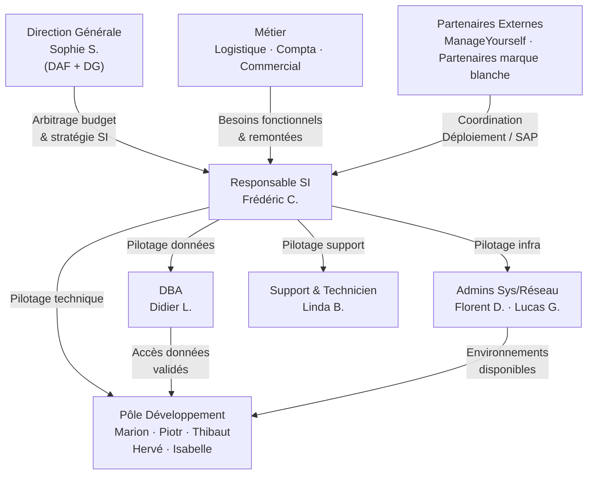

# Gouvernance du SI BricoLoc — Matrice RACI

## 1. Contexte et enjeux

BricoLoc est une PME de 9 entrepôts répartis en France dont le siège est à Toulouse. Sa DSI est composée de **12 personnes** (1 responsable SI, 5 développeurs, 2 admins sys/réseau, 1 DBA, 1 technicienne, 1 DBA externe via ManageYourself pour SAP).

L'absence de gouvernance formalisée du SI se manifeste concrètement par plusieurs symptômes critiques identifiés dans l'analyse de l'existant :

- Les développeurs passent la **majorité de leur temps en maintenance corrective**, générant régulièrement des **régressions**.
- Des **accès directs à la base de données** `bricolocDB` sont effectués depuis le front-end, depuis des scripts batch et depuis l'interface admin — en dehors de toute chaîne de responsabilité claire.
- Les **comptes administrateurs sont créés directement en base**, sans processus de contrôle IAM.
- Le **code source du service WCF** (VB.NET, IIS 8) a été **perdu** — aucune traçabilité, aucune procédure de gestion de configuration.
- Les **sources sont gérées via FTP** sans contrôle de version formel — chaque développeur gère ses propres versions « internes ».
- Une **VM Red Hat est active sur le réseau** sans que personne ne sache à quoi elle sert ni ne dispose des accès.
- La **documentation du SI n'est pas à jour** et sa révision est systématiquement reportée.

Ces dysfonctionnements justifient la mise en place d'une gouvernance du SI claire, avec des rôles définis et une matrice de responsabilités formalisée.

---

## 2. Identification des rôles impliqués dans la gouvernance du SI

| Rôle | Acteur(s) | Périmètre |
|---|---|---|
| Direction Générale / DAF | Sophie S. | Arbitrages stratégiques et budgétaires |
| DRH | Benjamin O. | Ressources humaines, recrutement IT |
| Responsable SI (DSI) | Frédéric C. | Pilotage global du SI, coordination DSI |
| Développeurs Java | Marion H., Piotr S., Thibaut E. | Front-end et back-end BricoLoc |
| Développeur .NET / Java | Hervé D. | Utilitaires internes, maintenance legacy |
| Développeuse Python / Data | Isabelle A. | Scripts data, alimentation Power BI |
| DBA | Didier L. | Administration Oracle, PL/SQL |
| Admins Sys/Réseau | Florent D., Lucas G. | Serveurs, réseau, VPN entrepôts |
| Technicienne / Support | Linda B. | Parc postes, support client applicatif |
| Responsable Compta (ref. SAP) | Nadine B. | Correspondante fonctionnelle SAP B1 |
| Intégrateur externe SAP | ManageYourself | Administration SAP Business One |
| Resp. Logistique | Tan F. | Gestion stocks entrepôts, animation chat |
| Équipe commerciale | Oussana O., Mathilde Z. | Relation client, remontées anomalies |
| Partenaires marque blanche | Clients externes | Déploiement solution BricoLoc chez eux |

---

## 3. Matrice RACI

> **Légende** : **R** = Responsible (réalise) · **A** = Accountable (décide, rend compte) · **C** = Consulted (consulté avant) · **I** = Informed (informé après)

| Processus SI | DG (Sophie) | DSI (Frédéric) | Dév. Java | Dév. .NET | Dév. Python | DBA (Didier) | Admins Sys | Tech. (Linda) | Compta (Nadine) | Logistique (Tan) | Ext. SAP |
|---|:---:|:---:|:---:|:---:|:---:|:---:|:---:|:---:|:---:|:---:|:---:|
| **Choix d'architecture et technologique** | A | R | C | C | C | C | C | — | — | — | — |
| **Développement nouvelles fonctionnalités BricoLoc** | I | A | R | C | C | C | I | I | C | C | — |
| **Maintenance corrective BricoLoc** | I | A | R | C | — | C | I | R | I | I | — |
| **Gestion des accès et identités (IAM)** | I | A | C | — | — | R | R | — | — | — | — |
| **Administration et évolution BDD (bricolocDB / Oracle)** | I | A | C | — | — | R | C | — | — | — | — |
| **Infrastructure, déploiement et réseau** | I | A | C | — | — | C | R | — | — | — | — |
| **Intégration ERP SAP Business One** | I | A | — | — | — | — | I | — | R | I | R |
| **Gestion des stocks (applicatif BricoLoc)** | I | A | R | C | — | C | — | — | — | C | — |
| **Sécurité du SI (politiques, audits)** | A | R | C | C | C | C | R | I | — | — | — |
| **Budget et arbitrages IT** | A | R | I | I | I | I | I | — | C | — | — |
| **Support utilisateurs et clients** | I | I | C | — | — | — | — | R | — | A | — |
| **Pilotage data / Power BI** | I | A | — | — | R | C | I | — | C | — | — |
| **Gestion de configuration et versioning des sources** | I | A | R | R | R | — | C | — | — | — | — |
| **Déploiement solution marque blanche** | A | R | C | — | — | C | C | — | — | — | — |

---

## 4. Observations issues de l'analyse — Lacunes de gouvernance actuelles

| Processus | Problème identifié | Impact |
|---|---|---|
| Gestion des accès | Comptes admin créés directement en BDD | Risque sécurité, absence de traçabilité |
| Gestion de configuration | Sources sur FTP sans Git | Code WCF perdu, impossible de reprendre la maintenance |
| Architecture | Logique métier dans le front-end et en PL/SQL | Pas de propriétaire clair, régressions en cascade |
| Infrastructure | VM Red Hat active sans accès ni responsable | Risque réseau, SPOF fantôme |
| Documentation | Schéma SI non maintenu | Vision incomplète, intégration des partenaires difficile |
| Support | Remontées anomalies multicanal non centralisé | Perte d'information, traitement en silo |

---

## 5. Diagramme — Hiérarchie de décision du SI BricoLoc

> Ce diagramme fait apparaître un **point de concentration critique** : le responsable SI Frédéric C. est le seul nœud de coordination entre la direction, les équipes techniques et les métiers. L'absence de processus formalisés rend ce nœud fragile (SPOF humain).
