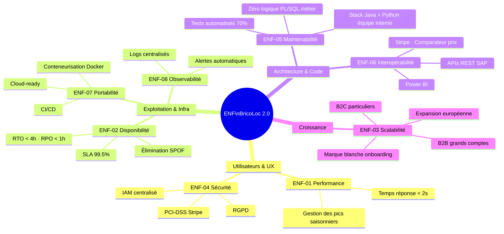

# BricoLoc 2.0 — Exigences Non Fonctionnelles (ENF)

## 1. Introduction

Les exigences non fonctionnelles (ENF) définissent les **contraintes de qualité** que la nouvelle architecture de BricoLoc doit respecter. Elles sont issues directement de l'analyse de l'existant et des ambitions stratégiques exprimées par la direction.

Elles constituent un **cadre d'évaluation** pour le choix des styles architecturaux et des technologies, et serviront de critères d'acceptation lors des phases de recette.

---

## 2. Synthèse des sources d'exigences

| Source | Éléments déclencheurs |
|---|---|
| **Perte de clients depuis 2020** | Bugs fréquents, régressions, performances dégradées |
| **Gestion des stocks incohérente** | Synchronisation batch quotidienne fragile (CSV → PL/SQL), 2 systèmes en parallèle |
| **Expansion européenne prévue** | 3 entrepôts dans 3 ans, puis Italie / Espagne |
| **Nouveaux segments** | Location entre particuliers (B2C), grands comptes bâtiment (B2B dans 5 ans) |
| **Marque blanche** | Déploiement chez des partenaires (hypermarchés) difficile à configurer |
| **Équipe DSI de 5 développeurs** | Architecture développable et maintenable en interne |
| **Souhait hébergement cloud** | Exprimé par le responsable informatique |
| **Dette technique lourde** | Application de 2013, stack obsolète, logique métier éparpillée |

---

## 3. Catalogue des exigences non fonctionnelles

### ENF-01 — Performance

> L'application doit répondre de manière fluide y compris lors des pics d'utilisation.

| ID | Exigence | Métrique cible | Justification |
|---|---|---|---|
| ENF-01-01 | Temps de réponse des pages du catalogue | < 2 secondes au P95 | UX dégradée citée comme cause de perte de clients |
| ENF-01-02 | Temps de réponse des APIs métier (recherche, dispo) | < 500 ms au P95 | Expérience utilisateur moderne attendue |
| ENF-01-03 | Disponibilité du calendrier de disponibilité | Temps réel ou quasi temps réel (< 1 min de lag) | Incohérence des stocks identifiée comme problème majeur |
| ENF-01-04 | Capacité à supporter les pics saisonniers | x3 charge nominale sans dégradation | Location d'outils = forte saisonnalité printemps/été |

---

### ENF-02 — Disponibilité & Résilience

> L'application doit rester opérationnelle même en cas de défaillance partielle.

| ID | Exigence | Métrique cible | Justification |
|---|---|---|---|
| ENF-02-01 | Disponibilité de l'application (SLA) | ≥ 99,5 % (≤ 44h d'indisponibilité/an) | E-commerce B2C — perte de revenus directe en cas de panne |
| ENF-02-02 | Aucun SPOF critique non mitigé | 0 composant critique sans solution de continuité | Service WCF (code perdu), batch CSV fragile, VM fantôme identifiés |
| ENF-02-03 | RTO (Recovery Time Objective) | < 4 heures | Délai acceptable de rétablissement après incident majeur |
| ENF-02-04 | RPO (Recovery Point Objective) | < 1 heure | Perte de données maximale acceptable |
| ENF-02-05 | Isolation des pannes | Une défaillance de module (ex. paiement) ne doit pas bloquer le catalogue | Architecture actuelle monolithique = régression en cascade |

---

### ENF-03 — Scalabilité & Élasticité

> Le système doit pouvoir évoluer pour accompagner la croissance de l'entreprise.

| ID | Exigence | Métrique cible | Justification |
|---|---|---|---|
| ENF-03-01 | Scalabilité horizontale des composants critiques | Ajout de nœuds sans interruption de service | Passage de 10 à 17+ entrepôts en 3 ans |
| ENF-03-02 | Support de nouveaux marchés géographiques | Intégration d'un entrepôt européen en < 1 sprint | Bruxelles, Lausanne, Francfort prévus dans 3 ans |
| ENF-03-03 | Support de nouveaux segments métier | Activation du module B2B/particuliers sans refonte | Location entre particuliers + grands comptes bâtiment |
| ENF-03-04 | Scalabilité de la solution marque blanche | Onboarding d'un nouveau partenaire en < 2 semaines | Difficulté actuelle = obstacle commercial |

---

### ENF-04 — Sécurité

> Le système doit protéger les données des utilisateurs et garantir l'intégrité des transactions.

| ID | Exigence | Métrique cible | Justification |
|---|---|---|---|
| ENF-04-01 | Gestion centralisée des identités et accès (IAM) | 0 compte créé directement en base de données | Comptes admin créés en BDD = risque majeur |
| ENF-04-02 | Conformité RGPD | Données personnelles des clients chiffrées au repos et en transit | Données clients (adresse, profil pro/particulier, historique locations) |
| ENF-04-03 | Cloisonnement des accès aux données | Principe du moindre privilège sur toutes les couches | Accès directs front→BDD sans contrôle existant |
| ENF-04-04 | Sécurisation des paiements | Conformité PCI-DSS niveau 1 | Intégration Stripe (paiement en ligne) |
| ENF-04-05 | Traçabilité des accès sensibles | Logs d'audit horodatés pour toute action admin | Aucune traçabilité aujourd'hui |

---

### ENF-05 — Maintenabilité & Évolutivité du code

> Le système doit pouvoir être maintenu et faire évoluer par une équipe de 5 développeurs.

| ID | Exigence | Métrique cible | Justification |
|---|---|---|---|
| ENF-05-01 | Couverture de tests automatisés | ≥ 70 % de couverture sur le code métier | Maintenance corrective génère des régressions répétées |
| ENF-05-02 | Absence de logique métier en dehors des couches métier | 0 trigger/procédure PL/SQL portant de la logique métier | Logique dans PL/SQL, front-end ET back-end = régressions |
| ENF-05-03 | Documentation du code et des APIs | 100 % des APIs publiques documentées (OpenAPI/Swagger) | Documentation actuelle non maintenue |
| ENF-05-04 | Durée d'onboarding d'un développeur | < 2 semaines pour être autonome | Turnover possible dans une équipe de 5 personnes |
| ENF-05-05 | Stack technologique maîtrisable par l'équipe interne | Technologies dans le périmètre Java + Python de l'équipe | Contrainte explicite du responsable informatique |

---

### ENF-06 — Interopérabilité & Intégration

> Le système doit s'intégrer proprement avec le SI existant et les systèmes tiers.

| ID | Exigence | Métrique cible | Justification |
|---|---|---|---|
| ENF-06-01 | API standards exposées vers l'ERP SAP | APIs REST documentées pour l'intégration SAP B1 | Intégration actuelle via batch CSV fragile |
| ENF-06-02 | Intégration du comparateur de prix SaaS | Contrat d'interface documenté et versionné | Service Java passerelle existant à refactoriser |
| ENF-06-03 | Intégration Stripe | API Stripe v3 minimum | Paiement en ligne existant à conserver |
| ENF-06-04 | Support marque blanche multi-tenant | Isolation de données entre partenaires garantie | Partenaires hypermarchés avec leur propre BDD |
| ENF-06-05 | Compatibilité avec Power BI | APIs ou connecteurs compatibles avec Power BI | Usage actuel à conserver pour le pilotage métier |

---

### ENF-07 — Portabilité & Déployabilité

> Le système doit pouvoir être déployé sur environnement cloud et chez des partenaires.

| ID | Exigence | Métrique cible | Justification |
|---|---|---|---|
| ENF-07-01 | Hébergement cloud-compatible | Déploiement sur un cloud public (Azure / AWS / GCP) | Souhait explicite du responsable informatique |
| ENF-07-02 | Conteneurisation | Application packagée en conteneurs Docker | Facilite le déploiement cloud et marque blanche |
| ENF-07-03 | Indépendance du SGBDR pour la marque blanche | Support Oracle, PostgreSQL, MySQL, SQL Server | Partenaires ont leur propre infrastructure |
| ENF-07-04 | Déploiement continu (CI/CD) | Pipeline de déploiement automatisé | 0 pipeline CI/CD actuellement — code géré en FTP |

---

### ENF-08 — Observabilité & Monitoring

> Le système doit permettre de détecter et diagnostiquer tout incident rapidement.

| ID | Exigence | Métrique cible | Justification |
|---|---|---|---|
| ENF-08-01 | Logs centralisés | Tous les composants envoient leurs logs vers une plateforme centrale | Actuellement aucune centralisation des logs |
| ENF-08-02 | Alertes sur les métriques critiques | Alertes automatiques si SLA dégradé ou stock incohérent | Problèmes actuels détectés trop tard (via remontées clients) |
| ENF-08-03 | Traçabilité des transactions métier | Chaque transaction (réservation, paiement, stock) est tracée de bout en bout | Incohérences de stocks non explicables actuellement |

---

## 4. Tableau de synthèse

| Domaine | Criticité | Complexité à adresser |
|---|:---:|:---:|
| ENF-01 Performance | ★★★★★ | Moyenne |
| ENF-02 Disponibilité & Résilience | ★★★★★ | Haute |
| ENF-03 Scalabilité | ★★★★☆ | Haute |
| ENF-04 Sécurité | ★★★★★ | Moyenne |
| ENF-05 Maintenabilité | ★★★★★ | Haute |
| ENF-06 Interopérabilité | ★★★★☆ | Moyenne |
| ENF-07 Portabilité | ★★★☆☆ | Moyenne |
| ENF-08 Observabilité | ★★★☆☆ | Faible |

---

## 5. Diagramme — Cartographie des ENF par domaine d'impact

