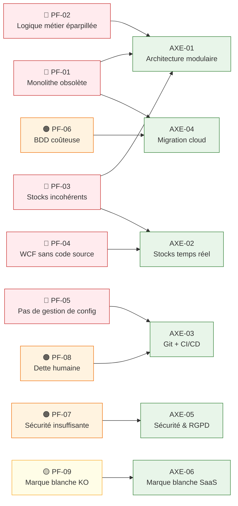

# BricoLoc — Axes d'amélioration et points faibles du SI

## 1. Objectif

Ce document constitue un **conseil aux décideurs** sur l'état actuel du SI de BricoLoc. Il identifie les points faibles structurels du SI existant, leurs impacts mesurables sur l'activité, et les axes d'amélioration prioritaires à intégrer dans la stratégie de transformation BricoLoc 2.0.

---

## 2. Points faibles identifiés

### PF-01 — Architecture monolithique vieillissante

**Constat** : L'application BricoLoc est en production depuis 2013 et son architecture a « peu évolué » depuis. Elle repose sur des technologies en fin de vie ou obsolètes : Java EE 6, WebLogic 12c R1, Oracle 11g R2, Tomcat 8.5 / Spring 5, Oracle Linux 6.5.

**Impact** :
- Chaque modification nécessite de toucher à l'ensemble du système → régressions fréquentes.
- Recrutement difficile sur des technologies obsolètes (Java EE 6 / WebLogic ne sont plus enseignés).
- Oracle Linux 6.5 et Oracle 11g R2 ne reçoivent plus de correctifs de sécurité.

**Criticité** : 🔴 Critique

---

### PF-02 — Logique métier éparpillée sur 3 couches non maîtrisées

**Constat** : La logique metier de BricoLoc est distribuée sans cohérence entre :
- le **back-end Java EE** (EJB/JPA),
- les **procédures stockées et triggers PL/SQL** dans Oracle,
- le **front-end Spring** (composants ayant migré leur propre logique métier),
- certains composants front accèdent directement à `bricolocDB` **sans passer par le back-end**.

**Impact** :
- Régressions en cascade à chaque maintenance corrective.
- Impossible de comprendre le comportement global sans maîtriser les 3 couches simultanément.
- Seul Didier L. (DBA) maîtrise réellement le PL/SQL → **dépendance critique sur une seule personne**.

**Criticité** : 🔴 Critique

---

### PF-03 — Gestion des stocks incohérente

**Constat** : La synchronisation des stocks entre l'ERP SAP Business One et l'application BricoLoc repose sur :
1. Un **export CSV quotidien** enregistré sur le serveur de fichiers Windows.
2. Un **batch Java asynchrone** qui lit ce CSV et invoque une procédure PL/SQL pour mettre à jour `bricolocDB`.

De plus, 4 entrepôts (Toulouse, Bordeaux, Montpellier, Avignon) testent la gestion directe via SAP tandis que les 6 autres utilisent encore le **client lourd C# → service WCF → bricolocDB**.

**Impact** :
- Délai d'un jour entre l'état réel des stocks et l'état visible sur le site.
- Incohérences régulières des disponibilités affichées aux clients.
- **Identifié comme l'une des causes principales de perte de clients depuis 2020**.

**Criticité** : 🔴 Critique

---

### PF-04 — Service WCF sans code source

**Constat** : Le service WCF VB.NET hébergé dans IIS 8 (Windows Server 2012) qui gère la communication des 5-6 entrepôts avec `bricolocDB` a un **code source perdu**. Il s'agit d'un composant en production, actif, non modifiable et non remplaçable à court terme.

**Impact** :
- En cas de panne, **aucune intervention corrective n'est possible**.
- Windows Server 2012 n'est plus supporté par Microsoft (fin du support étendu : octobre 2023).
- Blocage technologique total sur les entrepôts dépendants de ce service.

**Criticité** : 🔴 Critique · SPOF absolu

---

### PF-05 — Gestion de configuration inexistante

**Constat** : Les sources de l'application sont stockées sur un **serveur Ubuntu 20.04 via FTP**. Chaque développeur gère ses propres versions « internes ». Aucun système de contrôle de version formalisé (Git) n'est en place.

**Impact** :
- Perte de code source possible à tout moment (cf. PF-04 ci-dessus — cela s'est déjà produit).
- Impossible de tracer l'historique des modifications ou de faire des rollbacks.
- Collaboration entre développeurs non maîtrisée.
- Aucun pipeline CI/CD possible sans gestion de version.

**Criticité** : 🔴 Critique

---

### PF-06 — Base de données surdimensionnée et coûteuse

**Constat** : Pour pallier aux problèmes de performance, le serveur Oracle 11g R2 a été redéployé sur **2 serveurs physiques haute capacité**, générant des surcoûts importants en licences Oracle. La base `bricolocDB` contient des **tables et vues de plus de 150 colonnes**, témoignant de 10 ans de maintenance non structurée.

**Impact** :
- Surcoût en licences Oracle significatif et récurrent.
- Schéma de base dégradé : aucun développeur ne comprend l'ensemble du modèle de données.
- Performances nécessitant du hardware coûteux plutôt qu'une architecture efficace.

**Criticité** : 🟠 Élevé

---

### PF-07 — Sécurité insuffisante

**Constat** :
- Les **comptes administrateurs** de l'application sont créés directement dans `bricolocDB` sans processus IAM.
- Certains composants **front-end accèdent directement à la base** sans passer par des couches d'autorisation.
- La **VM Red Hat Linux est active sur le réseau** sans que personne ne connaisse son rôle ni ne dispose des accès.

**Impact** :
- Surface d'attaque élargie sans contrôle d'accès structuré.
- Conformité RGPD difficile à démontrer (pas de traçabilité des accès aux données personnelles).
- Risque de violation de données (données clients, données de paiement).

**Criticité** : 🟠 Élevé

---

### PF-08 — Dette humaine et organisationnelle

**Constat** :
- Tous les membres de la DSI ont **moins de 6 ans d'ancienneté** (sauf Didier L. arrivé en 2015).
- Le **responsable SI est le seul point de coordination** entre la direction, les équipes techniques et les métiers.
- La majorité du temps des développeurs est consacrée à la **maintenance corrective**, laissant peu de place à la valeur ajoutée.
- La documentation du SI « n'est pas à jour » et sa révision est « toujours remise à plus tard ».

**Impact** :
- Risque élevé en cas de départ du DBA (Didier L.) ou du responsable SI (Frédéric C.).
- Capacité d'innovation réduite à quasi-zéro.
- Onboarding de nouveaux développeurs complexe.

**Criticité** : 🟠 Élevé

---

### PF-09 — Solution marque blanche non compétitive

**Constat** : La solution marque blanche « ne prend pas vraiment » du fait de la difficulté à la configurer et paramétrer chez les partenaires. Le déploiement nécessite l'assistance de 3 personnes de la DSI (Marion D., Florent H., Didier L.).

**Impact** :
- Manque à gagner commercial significatif (partenaires hypermarchés non convertis).
- Mobilisation d'experts techniques pour des tâches de déploiement chez des partenaires.

**Criticité** : 🟡 Modéré (impact commercial)

---

## 3. Tableau récapitulatif

| ID | Point faible | Criticité | Impact métier | Impact technique |
|---|---|:---:|---|---|
| PF-01 | Architecture monolithique obsolète | 🔴 | Coût de changement élevé | Recrutement & sécurité |
| PF-02 | Logique métier éparpillée | 🔴 | Régressions → perte clients | Maintenabilité nulle |
| PF-03 | Gestion des stocks incohérente | 🔴 | **Cause directe perte de clients** | Batch fragile |
| PF-04 | Service WCF sans code source | 🔴 | SPOF sur 6 entrepôts | Irrécupérable en cas de panne |
| PF-05 | Pas de gestion de configuration | 🔴 | Perte de code possible | Collaboration impossible |
| PF-06 | BDD surdimensionnée et coûteuse | 🟠 | Surcoût licences Oracle | Schema dégradé |
| PF-07 | Sécurité insuffisante | 🟠 | Risque RGPD / violation données | Surface d'attaque large |
| PF-08 | Dette humaine & organisationnelle | 🟠 | Innovation bloquée | Dépendances clés humaines |
| PF-09 | Marque blanche non compétitive | 🟡 | Manque à gagner | Déploiement manuel |

---

## 4. Axes d'amélioration recommandés

### AXE-01 — Refonte architecturale vers une architecture modulaire et évolutive

Migrer vers une architecture découplée (API-first, microservices ou architecture modulaire) permettant :
- L'isolation des pannes,
- Le déploiement indépendant des composants,
- La scalabilité ciblée des modules critiques (stocks, paiement, catalogue).

**Adresse** : PF-01, PF-02, PF-03

---

### AXE-02 — Centralisation et temps réel de la gestion des stocks

Remplacer le batch CSV quotidien par une intégration événementielle ou par appel API synchrone entre SAP et l'application BricoLoc. Unifier le canal de mise à jour des stocks (éliminer la double voie WCF legacy / SAP).

**Adresse** : PF-03, PF-04

---

### AXE-03 — Mise en place d'une gestion de configuration et d'un pipeline CI/CD

Migrer les sources vers Git (GitHub / GitLab), définir une politique de branches, et mettre en place un pipeline CI/CD minimal couvrant les tests automatisés et le déploiement.

**Adresse** : PF-05, PF-08

---

### AXE-04 — Migration cloud et rationalisation des coûts d'infrastructure

Migrer l'hébergement vers le cloud (exprimé par le responsable informatique), en commençant par les composants les moins critiques (strangler fig pattern). Remplacer Oracle 11g sur serveur physique par une solution managée cloud (PostgreSQL managé ou Oracle Cloud).

**Adresse** : PF-01, PF-06

---

### AXE-05 — Renforcement de la sécurité et de la conformité RGPD

Mettre en place un IAM centralisé exploitant l'Active Directory existant, supprimer les accès directs front→BDD, auditer et éliminer la VM fantôme, documenter et tracer tous les accès aux données sensibles.

**Adresse** : PF-07

---

### AXE-06 — Standardisation de la solution marque blanche (SaaS multi-tenant)

Faire évoluer l'offre marque blanche vers un modèle SaaS multi-tenant hébergé par BricoLoc, éliminant la nécessité de déploiement chez le partenaire.

**Adresse** : PF-09

---

## 5. Diagramme — Points faibles et axes d'amélioration

