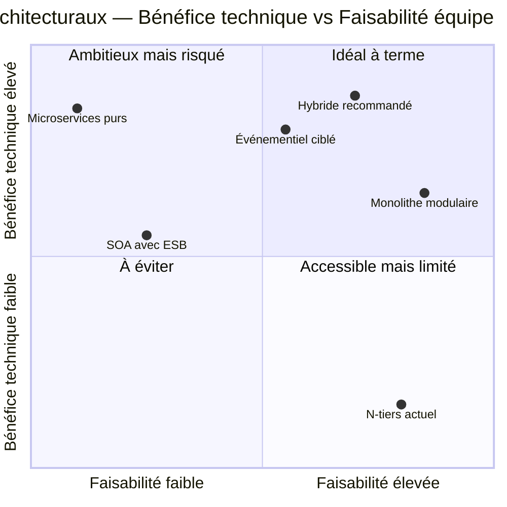

# BricoLoc 2.0 — Comparaison des styles architecturaux

## 1. Introduction

Le choix d'un style architectural est une décision structurante et difficile à inverser. Il doit être évalué au regard des **exigences non fonctionnelles** identifiées (cf. ENF) et des **contraintes concrètes** de BricoLoc :

- 5 développeurs internes (Java, Python, .NET) à maintenir productifs
- Dette technique massive à résorber progressivement (Big Bang impossible)
- Expansion européenne prévue à 3 ans
- Nouveaux segments : B2C particuliers, B2B grands comptes bâtiment
- Marque blanche à rationaliser en SaaS multi-tenant
- Hébergement cloud souhaité

Cinq styles architecturaux ont été analysés au regard de ce contexte.

---

## 2. Présentation des styles analysés

### Style 1 — Monolithe modulaire

**Principe** : L'application est déployée comme un unique artefact, mais structurée en modules internes cohésifs avec des interfaces définies entre eux.

**Exemple concret** : Un seul WAR/JAR déployé, divisé en modules Maven (catalogue, réservation, paiement, stocks) avec des interfaces Java strictes — pas d'appels croisés de l'implémentation.

**Avantages** :
- Déploiement simple (1 artéfact)
- Pas de complexité distribuée (pas de réseau entre composants)
- Transactions ACID natives sur toute l'application
- Stack connue des développeurs (Java)
- Facilement testable en intégration

**Inconvénients** :
- Scalabilité horizontale globale (impossible de scaler un seul module)
- Un composant défaillant peut impacter l'ensemble
- Couplage progressif au fil du temps si discipline absente

---

### Style 2 — Architecture en couches (N-tiers)

**Principe** : Le système est organisé en couches horizontales : présentation, logique métier, accès aux données. Chaque couche ne communique qu'avec la couche adjacente.

**Exemple concret** : C'est l'architecture **actuelle** de BricoLoc (Spring front → SOAP → WebLogic EJB → Oracle). Elle a été dévoyée : logique dans le front, dans la BDD, accès directs — ce qui est la source de tous les problèmes actuels.

**Avantages** :
- Simple à comprendre et organiser
- Bien adapté à des petites applications stables

**Inconvénients** :
- Pas scalable horizontalement par couche de manière indépendante
- Couplage fort entre les couches → régressions en cascade (problème BricoLoc actuel)
- N'adresse pas les ENF de disponibilité ni de scalabilité cible

---

### Style 3 — Architecture Orientée Services (SOA)

**Principe** : Le système est décomposé en services métier réutilisables, communiquant via un bus d'entreprise (ESB) ou des APIs. Les services sont coarsely-grained (périmètre métier large).

**Exemple concret** : Un service « Gestion des stocks » exposant ses opérations via SOAP/REST, consommé à la fois par l'application web, par SAP et par les entrepôts.

**Avantages** :
- Réutilisabilité des services entre applications (BricoLoc, SAP, marque blanche)
- Intégration SI existant facilitée
- Adapté à la coordination avec des systèmes tiers (SAP B1, Stripe, comparateur)

**Inconvénients** :
- ESB = point de centralisation complexe et coûteux
- Gouvernance lourde (catalogue de services, contrats d'interface)
- Complexité disproportionnée pour une équipe de 5 développeurs
- Performances impactées par les transformations ESB

---

### Style 4 — Microservices

**Principe** : L'application est décomposée en **services très fins**, chacun responsable d'une fonctionnalité précise, déployable indépendamment, avec sa propre base de données.

**Exemple concret** : Service `catalogue`, service `réservation`, service `stocks`, service `paiement`, service `utilisateurs`, service `notifications` — chacun avec sa propre BDD et son propre cycle de déploiement.

**Avantages** :
- Scalabilité indépendante par service (scaler `stocks` sans toucher `catalogue`)
- Isolation des pannes (une panne de `paiement` ne coupe pas le catalogue)
- Déploiement indépendant → réduction du risque de régression globale
- Technologiquement hétérogène (Java pour le back, Python pour la data)

**Inconvénients** :
- **Complexité opérationnelle élevée** : nécessite Kubernetes, service mesh, distributed tracing, API gateway
- Transactions distribuées complexes (pas de ACID natif entre services)
- **Sur-dimensionné pour une équipe de 5 développeurs sans expérience DevOps**
- Migration depuis le monolithe actuel = effort considérable

---

### Style 5 — Architecture événementielle (Event-Driven)

**Principe** : Les composants communiquent via des **événements asynchrones** publiés sur un bus de messages (Kafka, RabbitMQ). Les consommateurs réagissent aux événements sans couplage direct avec les producteurs.

**Exemple concret** : Quand un outil est retourné à l'entrepôt, un événement `OutilRetourné` est publié → le service de stocks met à jour la disponibilité → le service de notifications prévient les clients en attente. Aucun appel synchrone entre ces composants.

**Avantages** :
- Découplage fort entre producteurs et consommateurs
- Excellente résilience (les événements sont persistés même si un consommateur est hors ligne)
- Idéal pour la synchronisation des stocks en temps réel (remplace le batch CSV quotidien)
- Scalabilité naturelle

**Inconvénients** :
- Cohérence éventuelle (eventual consistency) — pas de cohérence immédiate garantie
- Débogage et traçabilité complexes (flux asynchrone)
- Nécessite une plateforme de messagerie (Kafka, RabbitMQ) à opérer
- Courbe d'apprentissage pour une équipe peu habituée

---

## 3. Comparaison synthétique

> Évaluation de 1 (mauvais) à 5 (excellent) pour chaque ENF clé.

| ENF / Contrainte | Monolithe modulaire | N-tiers (actuel) | SOA | Microservices | Événementiel |
|---|:---:|:---:|:---:|:---:|:---:|
| **ENF-01 Performance** | 3 | 2 | 3 | 5 | 4 |
| **ENF-02 Disponibilité & Résilience** | 3 | 1 | 3 | 5 | 5 |
| **ENF-03 Scalabilité** | 2 | 1 | 3 | 5 | 4 |
| **ENF-04 Sécurité** | 3 | 2 | 3 | 4 | 3 |
| **ENF-05 Maintenabilité** | 4 | 1 | 3 | 3 | 3 |
| **ENF-06 Interopérabilité** | 3 | 2 | 5 | 4 | 4 |
| **ENF-07 Portabilité / Cloud** | 4 | 2 | 3 | 5 | 4 |
| **ENF-08 Observabilité** | 3 | 2 | 3 | 4 | 3 |
| **Faisabilité équipe 5 devs** | 5 | 5 | 2 | 1 | 3 |
| **Compatibilité migration progressive** | 5 | — | 3 | 2 | 4 |
| **Délai de valeur (time-to-market)** | 5 | 5 | 2 | 1 | 3 |
| **TOTAL** | **40** | **23** | **33** | **39** | **40** |

---

## 4. Analyse par contrainte critique BricoLoc

### Contrainte : équipe de 5 développeurs

Les **microservices purs** nécessitent une maturité DevOps (orchestration Kubernetes, service mesh, distributed tracing, API gateway) incompatible avec une équipe de 5 développeurs sans infrastructure dédiée. Le **SOA avec ESB** est complexe à gouverner. Le **monolithe modulaire** et l'**approche événementielle ciblée** sont les mieux adaptés.

### Contrainte : migration depuis l'existant (pas de Big Bang)

Une refonte totale en microservices sur un monolithe actuel de 10 ans est connue pour échouer. Le pattern **Strangler Fig** (remplacement progressif par un nouveau système en parallèle de l'ancien) s'applique naturellement au **monolithe modulaire** et permet d'introduire progressivement de l'**événementiel** sur les flux critiques (stocks).

### Contrainte : gestion des stocks temps réel

L'**architecture événementielle** est le style le plus adapté pour remplacer le batch CSV quotidien par une synchronisation temps réel entre SAP, les entrepôts et l'application. Elle peut être introduite de manière ciblée sur ce flux sans remettre en cause toute l'architecture.

### Contrainte : marque blanche multi-tenant

Un **monolithe modulaire bien isolé** ou des **microservices** sont les mieux adaptés au multi-tenancy. Le SOA peut y contribuer mais au prix d'une complexité élevée.

---

## 5. Styles retenus — Recommandation

Voir le document dédié **[styles-retenus-justification.md]** (Passe 3).

En synthèse, l'approche recommandée est une **architecture hybride** :

| Composant | Style recommandé | Justification |
|---|---|---|
| Application BricoLoc (core) | **Monolithe modulaire** | Faisable par 5 devs, migration progressive, ACID natif |
| Synchronisation des stocks | **Événementiel** (Kafka / RabbitMQ) | Remplace le batch fragile, temps réel |
| Intégrations tierces (SAP, Stripe, prix) | **APIs REST** (approche SOA légère sans ESB) | Interopérabilité sans complexité ESB |
| Marque blanche | **Multi-tenant dans le monolithe** puis évolution SaaS | Objectif cible sans surcharge initiale |

---

## 6. Diagramme — Positionnement des styles selon faisabilité et bénéfice

