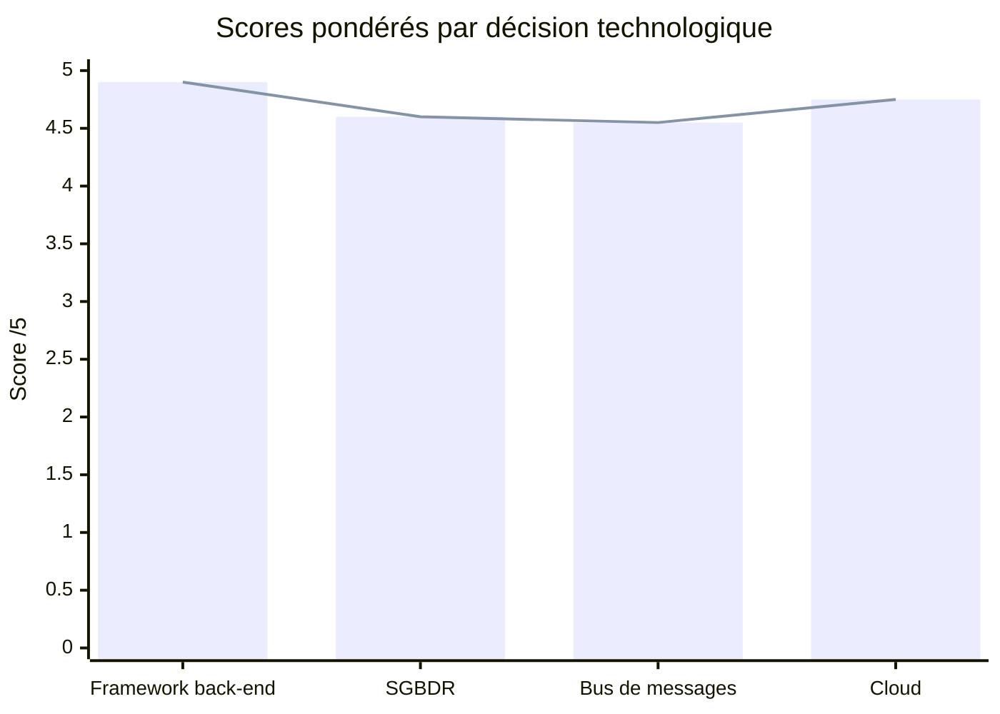

# BricoLoc 2.0 — Template Matrice de Choix Technologique

## 1. Objectif du template

Ce template permet de **justifier objectivement le choix d'une technologie** en comparant plusieurs candidats sur des critères pondérés, adaptés au contexte de BricoLoc. Il doit être utilisé pour chaque décision technologique structurante du projet.

Les critères sont choisis pour refléter les contraintes réelles du projet :
- Équipe de 5 développeurs internes (compétences Java, Python, .NET)
- Migration progressive depuis un SI legacy complexe
- Cible cloud, conteneurisation et CI/CD
- Budget PME, pas de licences propriétaires onéreuses si possible

---

## 2. Grille de pondération des critères

| # | Critère | Description | Poids |
|---|---|---|:---:|
| C1 | **Maturité & stabilité** | La technologie est éprouvée, documentée, avec une communauté active et un historique de releases stable | 15% |
| C2 | **Maîtrise par l'équipe interne** | La technologie est dans le périmètre de compétences des 5 développeurs (Java, Python, .NET) ou présente une courbe d'apprentissage raisonnable (< 1 mois pour être opérationnel) | 20% |
| C3 | **Compatibilité avec l'existant** | Intégration avec le SI actuel (Oracle, SAP B1, Spring, APIs REST) sans réécriture totale | 15% |
| C4 | **Performance** | Capacité à répondre aux ENF de performance (temps de réponse, charge, scalabilité) | 10% |
| C5 | **Coût total (TCO)** | Licence, infrastructure, formation, exploitation. Préférence pour l'open-source face aux solutions propriétaires onéreuses (cf. surcoût Oracle actuel) | 15% |
| C6 | **Portabilité & cloud-readiness** | Compatible avec le déploiement cloud (Azure / AWS / GCP), conteneurisation Docker, CI/CD | 10% |
| C7 | **Maintenabilité & écosystème** | Outils de debug, monitoring, test disponibles ; framework de test intégré ; conventions favorisant la lisibilité | 10% |
| C8 | **Support & pérennité** | Soutenu par une fondation, une grande entreprise ou une communauté massive. Pas un projet abandonné ou mono-mainteneur | 5% |

**Total des poids : 100%**

---

## 3. Barème de notation

| Note | Signification |
|:---:|---|
| 1 | Inadapté / très mauvais pour ce critère dans le contexte BricoLoc |
| 2 | Insuffisant avec des limitations importantes |
| 3 | Acceptable — répond partiellement au besoin |
| 4 | Bon — répond bien au besoin avec des réserves mineures |
| 5 | Excellent — répond parfaitement au besoin dans le contexte |

---

## 4. Structure du tableau de comparaison

> À reproduire pour chaque décision technologique. Les notes sont de 1 à 5. Le score pondéré = note × poids.

| Critère | Poids | Technologie A | Technologie B | Technologie C |
|---|:---:|:---:|:---:|:---:|
| C1 Maturité & stabilité | 15% | /5 | /5 | /5 |
| C2 Maîtrise équipe interne | 20% | /5 | /5 | /5 |
| C3 Compatibilité existant | 15% | /5 | /5 | /5 |
| C4 Performance | 10% | /5 | /5 | /5 |
| C5 Coût total (TCO) | 15% | /5 | /5 | /5 |
| C6 Portabilité & cloud | 10% | /5 | /5 | /5 |
| C7 Maintenabilité | 10% | /5 | /5 | /5 |
| C8 Support & pérennité | 5% | /5 | /5 | /5 |
| **Score pondéré** | **100%** | **/5** | **/5** | **/5** |
| **Décision** | | ⬜ | ⬜ | ⬜ |

---

## 5. Exemples appliqués au contexte BricoLoc

---

### 5.1 — Choix du framework back-end (remplacement de Java EE 6 / WebLogic)

**Contexte** : Remplacer l'architecture Java EE 6 déployée sur WebLogic 12c R1 (obsolète, coûteux en licences). L'équipe maîtrise Java.

| Critère | Poids | Spring Boot 3 | Quarkus | Jakarta EE 10 |
|---|:---:|:---:|:---:|:---:|
| C1 Maturité & stabilité | 15% | 5 | 4 | 4 |
| C2 Maîtrise équipe interne | 20% | **5** | 3 | 4 |
| C3 Compatibilité existant | 15% | 5 | 3 | 5 |
| C4 Performance | 10% | 4 | **5** | 4 |
| C5 Coût total (TCO) | 15% | **5** | 5 | 3 |
| C6 Portabilité & cloud | 10% | 5 | **5** | 4 |
| C7 Maintenabilité | 10% | 5 | 4 | 3 |
| C8 Support & pérennité | 5% | **5** | 4 | 4 |
| **Score pondéré** | **100%** | **4,90** | **4,15** | **3,95** |
| **Décision** | | ✅ **Retenu** | ⬜ | ⬜ |

**Justification** : Spring Boot 3 est directement dans le périmètre de compétences de l'équipe (Marion H., Piotr S., Thibaut E. travaillent déjà avec Spring 5). La migration depuis Spring 5 vers Spring Boot 3 est incrémentale. Open-source, déployable dans n'importe quel cloud ou conteneur Docker, sans licence propriétaire.

---

### 5.2 — Choix du SGBDR (remplacement d'Oracle 11g R2)

**Contexte** : Oracle 11g R2 en EOL, sur 2 serveurs physiques coûteux en licences. Il faut migrer vers une solution supportée, cloud-compatible, sans surcoût de licence.

| Critère | Poids | Oracle 19c Cloud | PostgreSQL 16 | MySQL 8 |
|---|:---:|:---:|:---:|:---:|
| C1 Maturité & stabilité | 15% | 5 | 5 | 5 |
| C2 Maîtrise équipe interne | 20% | 4 | 4 | 4 |
| C3 Compatibilité existant | 15% | **5** | 3 | 3 |
| C4 Performance | 10% | 5 | 5 | 4 |
| C5 Coût total (TCO) | 15% | 1 | **5** | 5 |
| C6 Portabilité & cloud | 10% | 4 | **5** | 5 |
| C7 Maintenabilité | 10% | 4 | 5 | 4 |
| C8 Support & pérennité | 5% | 5 | **5** | 4 |
| **Score pondéré** | **100%** | **3,85** | **4,60** | **4,25** |
| **Décision** | | ⬜ | ✅ **Retenu** | ⬜ |

**Justification** : PostgreSQL 16 est open-source, très performant, supporté nativement par tous les fournisseurs cloud (Azure Database for PostgreSQL, AWS RDS, GCP Cloud SQL). Il supporte le PL/pgSQL permettant une migration progressive du PL/SQL Oracle existant. Oracle 19c est éliminé par le coût prohibitif des licences — problème cité explicitement dans l'analyse de l'existant.

---

### 5.3 — Choix du bus de messages (synchronisation stocks temps réel)

**Contexte** : Remplacer le batch CSV quotidien SAP→BricoLoc par une synchronisation événementielle temps réel (ENF-01-03).

| Critère | Poids | Apache Kafka | RabbitMQ | ActiveMQ |
|---|:---:|:---:|:---:|:---:|
| C1 Maturité & stabilité | 15% | 5 | 5 | 4 |
| C2 Maîtrise équipe interne | 20% | 3 | 4 | 3 |
| C3 Compatibilité existant | 15% | 4 | 4 | 4 |
| C4 Performance | 10% | **5** | 4 | 3 |
| C5 Coût total (TCO) | 15% | 4 | **5** | 5 |
| C6 Portabilité & cloud | 10% | **5** | 5 | 3 |
| C7 Maintenabilité | 10% | 4 | **5** | 3 |
| C8 Support & pérennité | 5% | **5** | 5 | 3 |
| **Score pondéré** | **100%** | **4,20** | **4,55** | **3,60** |
| **Décision** | | ⬜ | ✅ **Retenu** | ⬜ |

**Justification** : RabbitMQ est plus simple à opérer et à apprendre que Kafka pour une équipe de 5 développeurs sans expérience streaming. Kafka est disproportionné pour les volumes de BricoLoc (synchronisation de stocks de 10 entrepôts). RabbitMQ est compatible Java (Spring AMQP) et Python (pika), dans le périmètre technologique de l'équipe.

---

### 5.4 — Choix de la plateforme cloud

**Contexte** : Migration de l'hébergement interne (siège Toulouse) vers le cloud, exprimée par le responsable informatique.

| Critère | Poids | Microsoft Azure | AWS | Google Cloud |
|---|:---:|:---:|:---:|:---:|
| C1 Maturité & stabilité | 15% | 5 | 5 | 5 |
| C2 Maîtrise équipe interne | 20% | 4 | 3 | 3 |
| C3 Compatibilité existant | 15% | **5** | 3 | 3 |
| C4 Performance | 10% | 5 | 5 | 5 |
| C5 Coût total (TCO) | 15% | 4 | 4 | 4 |
| C6 Portabilité & cloud | 10% | 5 | 5 | 5 |
| C7 Maintenabilité | 10% | 5 | 4 | 4 |
| C8 Support & pérennité | 5% | **5** | 5 | 5 |
| **Score pondéré** | **100%** | **4,75** | **4,15** | **4,15** |
| **Décision** | | ✅ **Retenu** | ⬜ | ⬜ |

**Justification** : BricoLoc utilise déjà l'écosystème Microsoft (Office 365, Exchange 2019, Windows Server, Active Directory, Power BI). Azure offre une intégration native avec ces outils existants (Azure Active Directory = extension naturelle de l'AD on-premise, Azure Database for PostgreSQL, Azure Container Apps). La courbe d'apprentissage est réduite par la familiarité avec l'écosystème Microsoft.

---

## 6. Diagramme — Scores comparatifs des 4 choix technologiques

> Tous les choix retenus atteignent un score pondéré supérieur à **4,5/5**, validant leur pertinence au regard des contraintes BricoLoc.
