# BricoLoc 2.0 — Schéma de la couche applicative

> Architecture logique en 5 couches + systèmes tiers

```mermaid
flowchart TB

    %% ═══════════════════════════════════════════════
    %% COUCHE 1 — CLIENTS
    %% ═══════════════════════════════════════════════
    subgraph CLIENTS["🌐 COUCHE CLIENTS"]
        direction LR
        C1["🖥️ Navigateur Web<br/><i>B2C · B2B · Admin</i>"]
        C2["📱 Application Mobile<br/><i>iOS · Android</i>"]
        C3["🏪 Partenaire Marque Blanche<br/><i>REST API v1</i>"]
        C4["👤 Salarié<br/><i>SSO Azure AD</i>"]
    end

    %% ═══════════════════════════════════════════════
    %% COUCHE 2 — API GATEWAY
    %% ═══════════════════════════════════════════════
    subgraph GATEWAY["🔒 API GATEWAY — Spring Cloud Gateway"]
        direction LR
        GW1["🔑 Authentification<br/>JWT"]
        GW2["🛡️ Rate Limiting<br/>Anti-abus"]
        GW3["🔐 TLS<br/>HTTPS"]
        GW4["🔀 Routage<br/>/api/v1/ · /api/v2/"]
    end

    %% ═══════════════════════════════════════════════
    %% COUCHE 3 — MONOLITHE MODULAIRE
    %% ═══════════════════════════════════════════════
    subgraph MONO["⚙️ MONOLITHE MODULAIRE — Spring Boot 3 / Java 21"]
        direction TB

        subgraph ROW1[" "]
            direction LR
            M1["📦 Catalogue<br/>━━━━━━━━<br/>Outils · Catégories<br/>Recherche full-text<br/>Comparateur prix<br/>Cache Redis"]
            M2["📅 Réservation<br/>━━━━━━━━<br/>Cycle de vie location<br/>Calendrier dispo<br/>Location P2P<br/>Annulation"]
            M3["📊 Stocks<br/>━━━━━━━━<br/>Source de vérité<br/>Temps réel SAP<br/>Inter-entrepôts<br/>Gestion gros outils"]
        end

        subgraph ROW2[" "]
            direction LR
            M4["💳 Paiement<br/>━━━━━━━━<br/>Stripe API v3<br/>PCI-DSS<br/>Transactions<br/>Remboursements"]
            M5["👥 Utilisateurs<br/>━━━━━━━━<br/>Auth JWT · RBAC<br/>5 rôles métier<br/>RGPD<br/>Azure AD SSO"]
            M6["🔔 Notifications<br/>━━━━━━━━<br/>Emails transactionnels<br/>Alertes logisticiens<br/>Chat applicatif<br/>Push mobile"]
        end

        subgraph ROW3[" "]
            direction LR
            M7["🛠️ Admin<br/>━━━━━━━━<br/>Back-office<br/>Gestion catalogue<br/>Gestion stocks<br/>Gestion partenaires"]
            M8["🏷️ Marque Blanche<br/>━━━━━━━━<br/>Multi-tenant<br/>Isolation données<br/>Personnalisation<br/>APIs partenaire"]
            M9["🔗 Intégration<br/>━━━━━━━━<br/>Passerelle unique<br/>SAP · Prix · Power BI<br/>Spring Batch<br/>Connecteurs REST"]
        end
    end

    %% ═══════════════════════════════════════════════
    %% COUCHE 4 — BUS ÉVÉNEMENTIEL
    %% ═══════════════════════════════════════════════
    subgraph MQ["📨 BUS ÉVÉNEMENTIEL — RabbitMQ"]
        direction LR
        E1(["StockUpdated"])
        E2(["ReservationCreated<br/>Confirmed · Cancelled"])
        E3(["PaymentValidated<br/>PaymentFailed"])
        E4(["PriceUpdated"])
        E5(["StockLow"])
    end

    %% ═══════════════════════════════════════════════
    %% COUCHE 5 — DONNÉES
    %% ═══════════════════════════════════════════════
    subgraph DATA["💾 COUCHE DONNÉES"]
        direction LR
        D1[("🐘 PostgreSQL 16<br/>━━━━━━━━<br/>bricolocDB<br/>1 schéma / module")]
        D2[("⚡ Redis<br/>━━━━━━━━<br/>Cache catalogue<br/>Sessions")]
        D3["☁️ Azure Blob Storage<br/>━━━━━━━━<br/>Photos outils<br/>Documents · Factures PDF"]
    end

    %% ═══════════════════════════════════════════════
    %% SYSTÈMES TIERS
    %% ═══════════════════════════════════════════════
    subgraph TIERS["🌍 SYSTÈMES TIERS"]
        direction TB
        T1["📋 SAP Business One<br/><i>Stocks · Compta</i>"]
        T2["💳 Stripe<br/><i>Paiement en ligne</i>"]
        T3["📊 Comparateur de Prix<br/><i>SaaS externe</i>"]
        T4["📈 Power BI<br/><i>Analytics</i>"]
        T5["📧 Azure Email<br/><i>SMTP</i>"]
    end

    %% ═══════════════════════════════════════════════
    %% FLUX ENTRE COUCHES
    %% ═══════════════════════════════════════════════

    %% Clients → Gateway
    C1 & C2 & C3 & C4 -->|"HTTPS"| GATEWAY

    %% Gateway → Monolithe
    GATEWAY -->|"Route authentifiée"| MONO

    %% Monolithe → Bus (publication)
    M3 -->|"Publie"| E1
    M3 -->|"Publie"| E5
    M2 -->|"Publie"| E2
    M4 -->|"Publie"| E3
    M9 -->|"Publie"| E4

    %% Bus → Monolithe (consommation)
    E1 -->|"Consomme"| M1
    E1 & E2 & E3 & E5 -->|"Consomme"| M6
    E2 -->|"Consomme"| M4
    E3 -->|"Consomme"| M2
    E5 -->|"Consomme"| M7

    %% Monolithe → Données
    MONO --> D1
    M1 --> D2
    M1 & M7 --> D3

    %% Tiers ↔ Modules
    T1 -->|"Webhook stocks"| M9
    T2 <-->|"API v3 + Webhooks"| M4
    M9 -->|"APIs REST"| T3
    T4 -->|"Pull analytics"| M9
    M6 --> T5

    %% ═══════════════════════════════════════════════
    %% STYLES
    %% ═══════════════════════════════════════════════
    style CLIENTS fill:#e3f2fd,stroke:#1565c0,stroke-width:2px,color:#0d47a1
    style GATEWAY fill:#e0f2f1,stroke:#00695c,stroke-width:2px,color:#004d40
    style MONO fill:#ede7f6,stroke:#4527a0,stroke-width:3px,color:#311b92
    style MQ fill:#fff3e0,stroke:#e65100,stroke-width:2px,color:#bf360c
    style DATA fill:#e8f5e9,stroke:#2e7d32,stroke-width:2px,color:#1b5e20
    style TIERS fill:#fce4ec,stroke:#880e4f,stroke-width:2px,color:#880e4f

    style ROW1 fill:transparent,stroke:none
    style ROW2 fill:transparent,stroke:none
    style ROW3 fill:transparent,stroke:none

    style M1 fill:#d1c4e9,stroke:#512da8,color:#311b92
    style M2 fill:#d1c4e9,stroke:#512da8,color:#311b92
    style M3 fill:#d1c4e9,stroke:#512da8,color:#311b92
    style M4 fill:#d1c4e9,stroke:#512da8,color:#311b92
    style M5 fill:#d1c4e9,stroke:#512da8,color:#311b92
    style M6 fill:#d1c4e9,stroke:#512da8,color:#311b92
    style M7 fill:#d1c4e9,stroke:#512da8,color:#311b92
    style M8 fill:#d1c4e9,stroke:#512da8,color:#311b92
    style M9 fill:#d1c4e9,stroke:#512da8,color:#311b92

    style E1 fill:#ffe0b2,stroke:#e65100
    style E2 fill:#ffe0b2,stroke:#e65100
    style E3 fill:#ffe0b2,stroke:#e65100
    style E4 fill:#ffe0b2,stroke:#e65100
    style E5 fill:#ffe0b2,stroke:#e65100

    style C1 fill:#bbdefb,stroke:#1565c0
    style C2 fill:#bbdefb,stroke:#1565c0
    style C3 fill:#bbdefb,stroke:#1565c0
    style C4 fill:#bbdefb,stroke:#1565c0

    style GW1 fill:#b2dfdb,stroke:#00695c
    style GW2 fill:#b2dfdb,stroke:#00695c
    style GW3 fill:#b2dfdb,stroke:#00695c
    style GW4 fill:#b2dfdb,stroke:#00695c

    style T1 fill:#f8bbd0,stroke:#880e4f
    style T2 fill:#f8bbd0,stroke:#880e4f
    style T3 fill:#f8bbd0,stroke:#880e4f
    style T4 fill:#f8bbd0,stroke:#880e4f
    style T5 fill:#f8bbd0,stroke:#880e4f
```

---

## Légende

| Couleur | Couche | Technologie |
|---|---|---|
| 🔵 Bleu | Clients | Web, Mobile, Partenaires, Salariés |
| 🟢 Teal | API Gateway | Spring Cloud Gateway |
| 🟣 Violet | Monolithe Modulaire | Spring Boot 3 / Java 21 — 9 modules |
| 🟠 Orange | Bus Événementiel | RabbitMQ — 5 types d'événements |
| 🟢 Vert | Données | PostgreSQL 16, Redis, Azure Blob Storage |
| 🔴 Rose | Systèmes Tiers | SAP, Stripe, Comparateur Prix, Power BI, SMTP |

## Flux principaux

| Flux | Description |
|---|---|
| **Clients → Gateway → Modules** | Toute requête passe par l'API Gateway (JWT + TLS + Rate Limiting) |
| **Modules → RabbitMQ → Modules** | Communication asynchrone pour stocks, réservations, paiements |
| **Module Intégration → Tiers** | Passerelle unique vers SAP, comparateur prix, Power BI |
| **Module Paiement ↔ Stripe** | Flux bidirectionnel : API + Webhooks |
| **Tous modules → PostgreSQL** | Persistance avec schéma dédié par module |
| **Catalogue → Redis** | Cache des fiches catalogue avec TTL configurable |
