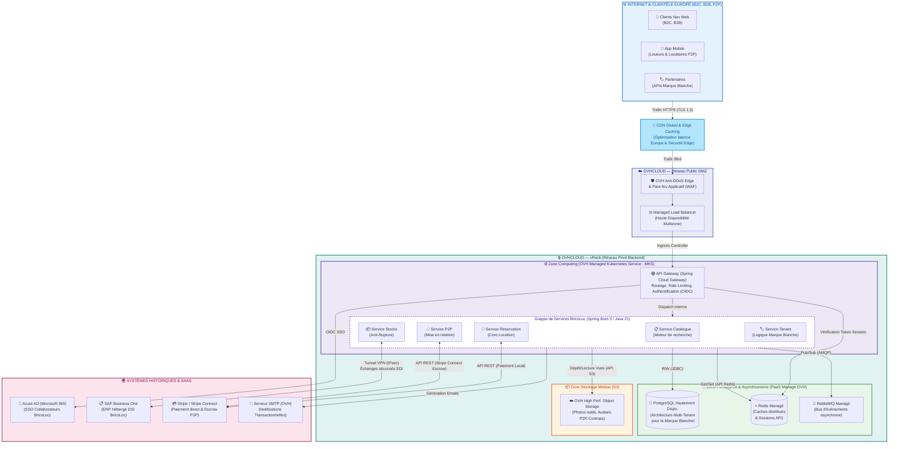

# BricoLoc 2.0 — Architecture d'Infrastructure Cible (V2)

## 1. Contexte et Alignement Stratégique

Afin de répondre aux nouveaux enjeux stratégiques de BricoLoc (ouverture au marché européen, nouvelle offre P2P "location entre particuliers", ciblage du B2B et déploiement en Marque Blanche), l'architecture d'infrastructure a été profondément repensée selon une logique de **Cloud-Native** et d'**amélioration continue**.

Hébergée sur **OVHcloud** (choix justifié par la souveraineté des données, l'éco-responsabilité et la prédictibilité des coûts), cette version V2 met en place :
* **Une scalabilité horizontale** via l'utilisation de clusters Kubernetes managés, essentielle pour absorber la charge lors de l'expansion européenne.
* **Un découplage des services métier** (Catalogue, B2B, P2P, Marque Blanche) pour réduire au maximum l'effet "boule de boue" (Big Ball of Mud) dont souffrait l'ancienne architecture monolithique.
* **Une sécurité périmétrique stricte** (Zero Trust local) avec un routage assuré par une API Gateway limitant l'exposition publique.

---

## 2. Schéma d'Architecture d'Infrastructure (SI) — V2 Cible

Ce schéma montre la déclinaison des services applicatifs et données au sein de l'environnement sécurisé d'OVHcloud, ainsi que leurs interactions avec le SI 'On-Premise' historique (notamment SAP) et les systèmes SaaS tiers.

---

## 3. Justifications Académiques et Architectoniques de la V2

Conformément à l'analyse de nos exigences non-fonctionnelles et en accord avec la grille d'architecture logicielle :

### 3.1. Approche de l'Extensibilité Européenne et P2P
L'introduction d'un **CDN (Content Delivery Network)** devient capitale pour mettre en cache les données statiques (images d'outils, assets front-end) au plus près des prochains utilisateurs (Bruxelles, Espagne, Italie).
De plus, la nouvelle brique **Service P2P** pour la location entre particuliers nécessite la délégation du cantonnement financier à **Stripe Connect** (Escrow payment), évitant à BricoLoc de lourdes responsabilités de conformité bancaire de type KYC/AML.

### 3.2. Séparation des Responsabilités (Microservices vs Monolithe)
Le passage progressif vers une grappe de services sur **Managed Kubernetes (MKS)** répond au problème identifié de la "grande boule de boue". Elle apporte deux avantages majeurs :
* Une scalabilité fine (ex. le *Service Catalogue* encaisse beaucoup plus de charge en lecture que le *Service Réservation*).
* Une meilleure maintenabilité pour l'équipe des 5 développeurs Java, qui peuvent désormais livrer et opérer leurs modules de manière dissociée.

### 3.3. Intégration du Système Historique (SAP ERP)
Le SI de BricoLoc n'est pas remplacé du jour au lendemain, nous sommes dans des **architectures hybrides**. La mise en place d'un pont **VPN IPsec** entre le réseau interne de l'entreprise (hébergeant SAP Business One) et le **vRack d'OVHcloud** garantit que nos données de gestion de stocks ne transitent de manière sécurisée et cryptée que dans un tunnel dédié.

### 3.4. Réponse au besoin "Marque Blanche"
Le déploiement en Marque Blanche était complexe car inadapté à l'installation directe par les partenaires. L'architecture **Multi-Tenant SaaS API-First** a été privilégiée :
L'API Gateway vérifie l'identité du partenaire via son Token d'API, pour le rediriger vers le *Service Tenant* (et le partitionnement logique dans la base PostgreSQL). Cela allège l'infrastructure du client sans exiger l'installation d'outils lourds chez lui.

### 3.5. Adoption du paradigme Asynchrone (Green IT et Performance)
Dans un contexte asynchrone, un service d'évènements comme **RabbitMQ Managé** permet à un module (ex: *Service P2P*) d'émettre un évènement sans attendre qu'un autre service (*Service de Notification SMTP*) le consomme. Cette élasticité lisse la demande de ressources de calcul sur les hyperviseurs, et concourt à la stratégie de rentabilité énergétique d'OVHcloud. 
