# BricoLoc — Architecture d'Infrastructure Existante (As-Is) et Analyse des Faiblesses

## 1. Schéma d'Architecture d'Infrastructure (Existant)

Ce schéma représente l'architecture technique et applicative actuelle du système d'information de BricoLoc, avant refonte. Il met en évidence (en rouge et orange) les éléments problématiques et les axes d'amélioration identifiés.

```mermaid
---
config:
  layout: elk
---
flowchart LR

    %% ═══════════════════════════════════════════════
    %% UTILISATEURS / EXTERNE
    %% ═══════════════════════════════════════════════
    subgraph EXTERNAL["🌐 UTILISATEURS & EXTERNES"]
        direction TB
        U_Web["👥 Internautes & Clients"]
        SalBrico["💼 Salarié BricoLoc"]
        Dev["👨‍💻 Développeurs / DSI"]
        Partenaire(("🤝 Partenaire\nMarque Blanche"))
        Comparateur(("📊 Comparateur de Prix\nSaaS (API REST)"))
        Stripe(("💳 API Stripe\nPaiement"))
        O365(("☁️ Office 365\nBureautique"))
    end

    %% ═══════════════════════════════════════════════
    %% FRONT-END / DMZ
    %% ═══════════════════════════════════════════════
    subgraph Z_FRONT["🖥️ Serveur Ubuntu 20.04 TLS (Front-end)"]
        direction TB
        Proxy("Proxy: Apache HTTP Server")
        Tomcat("Serveur d'App: Apache Tomcat 8.5")
        Spring("Front-End (Spring 5)")
        AdminUI("🚨 Interface Admin\n- Manipulation de stocks -")
        FonctionnalitesFront("🚨 Logique Métier\n(Éparpillée dans le Front)")
        MySQL[("Cache Front-End\n(MySQL 5)")]
        
        Proxy --> Tomcat
        Tomcat --> Spring & AdminUI & FonctionnalitesFront
        Spring -.->|"Mise en cache"| MySQL
    end

    %% ═══════════════════════════════════════════════
    %% BACK-END
    %% ═══════════════════════════════════════════════
    subgraph Z_BACK["⚙️ Serveur Oracle Linux 6.5 (Back-end) — OBSOLÈTE"]
        direction TB
        WebLogic("WebLogic Server 12c R1")
        JavaEE("Back-End (Java EE 6)\nEJB, JPA")
        
        WebLogic --> JavaEE
    end

    %% ═══════════════════════════════════════════════
    %% BASES DE DONNÉES / DATA
    %% ═══════════════════════════════════════════════
    subgraph Z_DATA["🗄️ Cluster Oracle 11g R2 (Surdimensionné)"]
        direction TB
        OracleDB[("RDBMS Oracle 11g R2")]
        AuthDB[("autorisationDB\n(Identités, Rôles)")]
        PrixDB[("prixDB\n(Prix concurrents)")]
        BricoDB[("🚨 bricolocDB\n(Métier & Admin)")]
        PLSQL["🚨 Procédures PL/SQL & Triggers\n>150 colonnes/table\n(Dette Technique)"]
        
        OracleDB --> AuthDB & PrixDB & BricoDB
        BricoDB -.->|"Implémente logique métier"| PLSQL
    end

    %% ═══════════════════════════════════════════════
    %% ENVIRONNEMENT INTERNE Bricoloc (Siège)
    %% ═══════════════════════════════════════════════
    subgraph Z_SIEGE["🏢 Environnement Windows interne (Siège)"]
        direction TB
        AD("Active Directory (AD)\nContrôleur de Domaine (Redondé)")
        Exchange("Microsoft Exchange 2019\n(Win Server 2022)")
        Fichiers("Serveur de fichiers\n+ CSV Stocks\n(Win Server 2022)")
        ERP["ERP SAP Business One 9.X\n(Win Server 2022)"]
        WCF("🚨 Service WCF 4.X (VB.NET)\nsur IIS 8 (Win 2012 OBSOLÈTE)\nCODE PERDU")
        
        Exchange -.->|"Auth"| AD
        Fichiers -.->|"Intégré"| AD
        ERP -.->|"Intégré"| AD
        WCF -.->|"Intégré"| AD
    end

    %% ═══════════════════════════════════════════════
    %% AUTRES SERVEURS
    %% ═══════════════════════════════════════════════
    subgraph Z_AUTRES["🔧 Autres serveurs internes"]
        direction TB
        UbuntuFTP("🚨 Serveur FTP Ubuntu 20.04\n(Codes sources : Pas AD, Pas Git)")
        Passerelle("Service Java Passerelle")
        BatchJava("🚨 Batch Java\n(Synchronisation BDD directe)")
        PowerBI("PowerBI Analytics")
        PythonScripts("Scripts Python Data")
        VM("👻 VM Mascotte Red Hat\n(Fantôme, accès perdu)")
    end

    %% ═══════════════════════════════════════════════
    %% ENTREPÔTS
    %% ═══════════════════════════════════════════════
    subgraph Z_ENTREPOTS["🏭 Entrepôts (Localisation Multiple)"]
        direction TB
        ClientLourd["🚨 Client Lourd C#\n(Gestion de Stocks)"]
        EntrepotSAP["Entrepôts Tests SAP\n(Nouveau process SI)"]
    end

    %% ═══════════════════════════════════════════════
    %% INTERACTIONS ET FLUX
    %% ═══════════════════════════════════════════════
    U_Web -->|"HTTP/HTTPS"| Proxy
    SalBrico -->|"Bureautique"| O365
    SalBrico -->|"Messagerie"| Exchange
    SalBrico -->|"Utilise"| ERP & Fichiers
    
    Dev -->|"🔴 Accès FTP (Sans Git)"| UbuntuFTP
    Dev -->|"🔴 Création Comptes DIRECTE"| BricoDB
    Dev -->|"Accès Admin"| AdminUI
    
    ClientLourd -->|"Requêtes Stocks"| WCF
    EntrepotSAP -->|"Saisie Stocks"| ERP
    
    Partenaire -->|"Tentative d'installation\n(Échec courant)"| Z_BACK & Z_DATA
    
    Spring -->|"Paiement en ligne"| Stripe
    Spring -->|"Appels SOAP normaux"| WebLogic
    Spring ==>|"🔴 PROBLEME :\nBy-pass Back-end\nAccès BDD direct"| OracleDB
    
    AdminUI ==>|"🔴 PROBLEME :\nManipulation stocks directe"| OracleDB
    WCF ==>|"🔴 PROBLEME :\nRequêtes BDD directes"| BricoDB
    
    JavaEE -->|"Connexion normale"| BricoDB & AuthDB
    
    Comparateur -->|"API REST"| Passerelle
    Passerelle -->|"Données Prix"| ERP & PowerBI & PrixDB
    
    BatchJava -->|"Sync. Prix"| BricoDB
    PrixDB -.-> BatchJava
    
    Fichiers -->|"CSV Stocks (Quotidien)"| Passerelle
    Passerelle -->|"Traite CSV & Invoque"| PLSQL
    
    PythonScripts -->|"Alimente"| PowerBI
    ERP -->|"BI"| PowerBI
    OracleDB -->|"BI"| PowerBI

    %% ═══════════════════════════════════════════════
    %% STYLES & CLASSES
    %% ═══════════════════════════════════════════════
    classDef problem fill:#ffebee,stroke:#d32f2f,stroke-width:3px,color:#b71c1c,font-weight:bold
    classDef frontend fill:#e3f2fd,stroke:#1e88e5,stroke-width:1px
    classDef backend fill:#e8f5e9,stroke:#43a047,stroke-width:1px
    classDef database fill:#fff8e1,stroke:#fbc02d,stroke-width:2px
    classDef os fill:#f5f5f5,stroke:#9e9e9e,stroke-width:1px,stroke-dasharray: 4 4
    classDef external fill:#f3e5f5,stroke:#ab47bc,stroke-width:1px
    classDef legacy fill:#fff3e0,stroke:#fb8c00,stroke-width:2px,color:#e65100
    classDef ghost fill:#eceff1,stroke:#546e7a,stroke-dasharray:8 4
    classDef erp fill:#e1f5fe,stroke:#039be5,stroke-width:2px

    %% Application des classes
    class AdminUI,FonctionnalitesFront,WCF,BatchJava,UbuntuFTP,PLSQL,BricoDB problem
    class Proxy,Tomcat,Spring frontend
    class WebLogic,JavaEE backend
    class MySQL,OracleDB,AuthDB,PrixDB database
    class AD,Exchange,Fichiers,ERP os
    class ERP erp
    class ClientLourd legacy
    class VM ghost
    class Stripe,Comparateur,O365,Partenaire external

```

---

## 2. Analyse de l'Existant (Axes d'amélioration)

L'architecture actuelle de l'application BricoLoc souffre de nombreux antipatterns qui s'expliquent par un développement historique empilé en "silos" sans vision architecturale globale. Cela entrave la maintenabilité de l'application, augmente la dette technique et ralentit significativement les temps de livraison et de résolution de bugs (Time to Market et Mean Time To Repair).

### 2.1. Antipathern "Big Ball of Mud" (La Grande Boule de Boue)
L'absence de claire séparation des responsabilités entre le Front-End (Spring), le Back-End (Java EE) et la base de données (PL/SQL) a entraîné des conséquences graves :
* **Dépendances cycliques et Bypass de la Business Logic** : L'interface Spring et l'interface AdminUI effectuent parfois des requêtes directement sur le serveur OracleDB (sans passer par les Webservices SOAP existants). Toute évolution du schéma de base de données (déjà composé de tables à >150 colonnes) risque donc de briser ces accès en dur.
* **Complexité PL/SQL de la couche de persistance** : Avec des milliers de lignes de code SQL imbriquées dans des procédures stockées et triggers qu'un seul membre de l'équipe (Didier L.) maîtrise, la résilience de l'entreprise repose sur un "Single Point of Failure" (SPOF) humain concernant la logique métier.
* **Risques sur l'intégrité de la donnée** : La manipulation des stocks directement par l'admin depuis le Front (ou par les anciens clients C# via le WCF legacy) explique les **incohérences de stock**. Chaque point d'entrée modifiant ou lisant à la volée la base BricoDB contourne potentiellement les règles métier.

### 2.2. Obsolescence Technique et Sécurité
Le système compte plusieurs briques n'étant plus supportées, créant des vulnérabilités critiques :
* **Serveurs obsolètes** : Oracle Linux 6.5 hébergeant WebLogic n'est plus maintenu, tout comme le serveur Windows Server 2012 (IIS 8).
* **Code WCF "Perdu"** : Le fait que le code d'un service critique interrogeant directement la base de données ait été perdu impose de réécrire le SI et pose la problématique de documentation (désastre DevOps/Gestion des Assets).
* **Serveur FTP pour Coder sans Git** : Le stockage manuel des codes sources sur un serveur FTP non connecté à l'AD (Ubuntu 20.04) empêche l'intégration continue (CI/CD), la gestion saine des versions, la possibilité d'auditer les modifications des développeurs et une collaboration sûre (gestion des conflits et rollback impossible). 
* **La "VM Fantôme"** : Un serveur actif dont personne ne connait l'accès témoigne d'une gouvernance IT défaillante.

### 2.3. Contraintes sur la Marque Blanche (Multi-Tenant)
Ce SI étant originellement taillé sur-mesure (et de manière archaïque) pour être hébergé par la DSI de BricoLoc, le distribuer en tant que solution logicielle (SaaS P2P/B2B/Marque blanche) requiert des équipes d'intervention manuelle pour installer WebLogic, cloner une base de données surdimensionnée "Oracle 11g" et répliquer un écosystème qui est impossible à standardiser. La stratégie on-premise freine drastiquement l'expansion B2B prévue par la Direction. 

### Conclusion
Le SI est figé, non évolutif et sujet aux risques de sécurité et d'intégrité de gestion de données (particulièrement des stocks). Les solutions à envisager exigent de retravailler l'architecture autour de **services encapsulés et découplés**, de remanier la politique de **gouvernance du code (Git / CI / CD)**, et de basculer vers un **SGBDR moins propriétaire et mieux cloisonné** pour éclipser à terme la dette colossale OracleDB, soutenues par une infrastructure **Cloud native et infogérée**.
