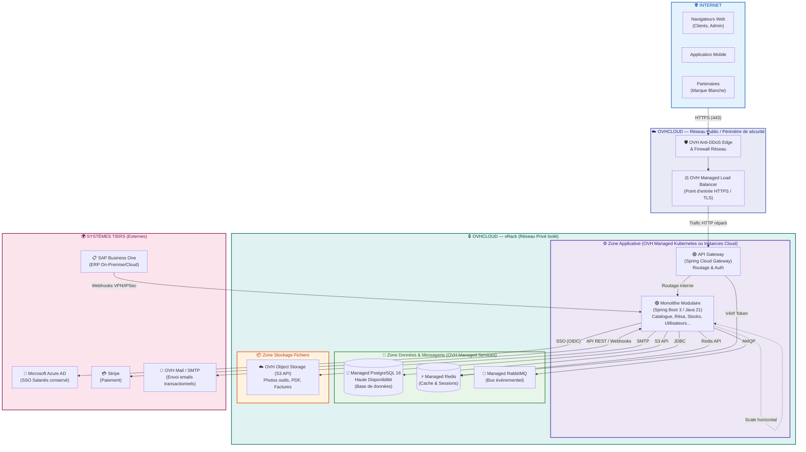

# BricoLoc 2.0 — Architecture d'Infrastructure (OVHcloud)

## 1. Introduction

Suite à la décision documentée dans la [matrice de choix Cloud (`matrice-choix-cloud-v2.md`)](matrice-choix-cloud-v2.md), le fournisseur retenu pour l'hébergement de BricoLoc 2.0 est **OVHcloud**. 
Ce choix garantit la **souveraineté des données** (hors de portée du CLOUD Act américain), des **coûts maîtrisés** (bande passante incluse/prévisible) et une approche **éco-responsable (Green IT)**.

Ce document décrit la projection de notre architecture logique (voir `architecture-logique.md` et `schema-couche-applicative.md`) sur les services d'infrastructure d'OVHcloud.

---

## 2. Schéma d'Architecture d'Infrastructure (SI)

---

## 3. Choix des composants et services OVHcloud
*L'architecture s'appuie au maximum sur les services managés d'OVHcloud afin de libérer l'équipe de 5 développeurs des tâches d'administration système.*

| Composant Logique | Service OVHcloud correspondant | Justification |
|---|---|---|
| **Réseau Public / Point d'entrée** | **OVH Load Balancer** + **Anti-DDoS** | Distribue le trafic entrant sur plusieurs instances de l'API Gateway, gère les certificats SSL/HTTPS, et protège contre les attaques réseau. |
| **Réseau Privé** | **vRack** | Connecte tous nos serveurs et bases de données dans un réseau privé (LAN) isolé d'Internet. Seuls le Load Balancer et l'API Gateway sont exposés publiquement. |
| **Zone Applicative (API Gateway + Monolithe)** | **Managed Kubernetes Service (MKS)** ou **Public Cloud Instances** | L'encapsulation via conteneurs Docker (sur Kubernetes ou instances simples) permet de redémarrer et de mettre à l'échelle automatique le monolithe. |
| **Base de données relationnelle** | **Managed Databases for PostgreSQL** | Service entièrement géré par OVH (sauvegardes auto, mises à jour de sécurité, haute disponibilité). Remplace le vieux Oracle. |
| **Cache & Sessions** | **Managed Databases for Redis** | Indispensable pour stocker les sessions utilisateurs de manière distribuée et mettre en cache le catalogue (pour soulager la base de données). |
| **Bus Événementiel** | **Managed RabbitMQ** ou **Managed Kafka** | Assure la communication asynchrone entre les modules (ex: notification de stock bas, confirmation de réservation). Service géré pour éviter la maintenance. |
| **Stockage Fichiers (S3)** | **High Performance Object Storage** ou **Standard Object Storage** | Stockage évolutif avec une API compatible S3 pour les images d'outils, les PDF de factures. Remplace le choix initial d'Azure Blob Storage pour conserver nos données en France. |

## 4. Intégration des Systèmes Tiers

Bien que l'hébergement cœur soit sur OVHcloud, nous conservons nos systèmes tiers existants :
* **Active Directory (SSO) :** BricoLoc utilisant massivement l'écosystème Microsoft pour l'organisation interne, **Azure AD** reste le fournisseur d'identité pour les employés. Le monolithe (Module Utilisateurs) validera les connexions via OpenID Connect.
* **Mails :** Utilisation du service **Email Pro OVH** ou d'un relais SMTP associé pour les notifications transactionnelles (remplace Azure Email).
* **SAP Business One :** Communication sécurisée (IPSec/VPN ou flux whitelistes) entre notre infrastructure OVH et le serveur ERP pour synchroniser les stocks.
