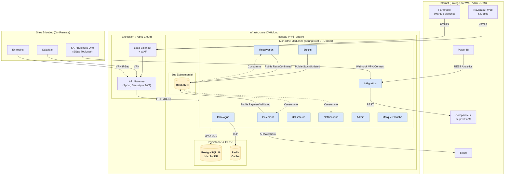

# Analyse Critique et Évaluation du Schéma d'Infrastructure Cible (OVHcloud)

Ce document consigne l'évaluation du schéma d'infrastructure `schema-infrastructure-cible-v2.drawio` au regard de la **grille d’évaluation académique** (`grille_évaluation.md`), des **orientations du cours d'architecture**, ainsi que des **justifications techniques et contraintes du contexte BricoLoc**. L'objectif s'inscrit dans une pure démarche d'**amélioration continue** pour fiabiliser les livrables avant la soutenance.

---

## 1. Respect des critères académiques (Grille d'évaluation)

Selon le critère de conception (*"L'architecture logique de l'application à développer est schématisée de façon détaillée. Les composants logiques et leurs interactions sont représentés."*), évalué sur **3 points**, le schéma présente les caractéristiques suivantes :

### 🟢 Les points forts (Acquis)
* **Zonage clair du Cloud** : La distinction entre la zone d'exposition publique ("Public Cloud OVH") et la zone interne sécurisée ("Réseau Privé OVH vRack") met en lumière la compréhension des fondamentaux d'hygiène applicative et structurelle.
* **Déclinaison applicative explicite** : L'utilisation de `Spring Security + JWT` sur l'API Gateway prouve l'intégration de la logique "Sécurité & Confiance" et répond partiellement à l'ENF-04 (Sécurité).
* **Isolation des BDD** : La séparation claire entre une base persistance structurelle (`PostgreSQL`), un système de cache in-memory (`Redis` pour le catalogue favorisant les performances ENF-01) et un Message Broker (`RabbitMQ`) démontre une maturité dans le choix technologique.

### 🟠 Les fragilités structurelles (Écarts constatés)
* **Accès "Cru" à l'API Gateway** : Bien que l'API Gateway protège l’applicatif, la face publique devrait être adossée à un **Load Balancer (vLB OVH)** et un **WAF (Web Application Firewall)** pour répondre aux enjeux de Déni de Service (DDoS) soulevés par la matrice de choix cloud et protéger le Cloud Act. Sans quoi, l'infrastructure est structurellement vulnérable aux attaques frontales.
* **Absence du modèle d'exécution (Compute)** : Le schéma indique que le "Monolithe Modulaire" réside dans le vRack, mais omet l'environnement d'infrastructure (ex: "Instances Compute EC2-like", ou "Cluster OVH Managed Kubernetes"). L'abstraction est légèrement trop forte ici vis-à-vis d'une "démarche d'architecture cohérente détaillée".

---

## 2. Incohérences avec les justificatifs d'architecture

L'examen minutieux du schéma Draw.io face au document officiel des styles (`styles-retenus-justification.md`) lève plusieurs "trous dans la raquette" :

1. **Le module fantôme "Marque Blanche"** : 
   Le justificatif référence très clairement **9 modules** dans le monolithe, dont le module crucial "Marque Blanche" (pour isoler les développements spécifiques B2B/Partenaires). Sur votre Draw.io, le composant `monolithe` n'en contient que 8. `Marque Blanche` a complètement disparu du diagramme.
2. **Sous-représentation du Pattern Événementiel** :
   Le diagramme positionne `RabbitMQ` et y accroche uniquement 2 modules : `Stocks` et `Notifications`. Or, la matrice événementielle indique explicitement un flux de souscription/production étendu pour traiter `ReservationConfirmed` et `PaymentValidated` via les modules `Réservation` et `Paiement`. Sur le schéma actuel, on donne l'impression que la réservation ou le paiement n'utilisent aucune asynchronie.
3. **Le casse-tête du réseau SAP** :
   Le contexte BricoLoc (`contexte-bricoloc.md`) précise que **SAP est hébergé en dur au siège social** (Toulouse). Le schéma Draw.io qualifie la communication de "Webhook StockUpdated" en omettant le lien physique. Contrairement au client des entrepôts qui mentionne `(VPN)`, l'intégration SAP nécessite l'apparition expresse d'un **VPN Site-to-Site ou OVHcloud Connect**.
4. **Lapsus d'attention (Bonus qualité)** :
   À la toute fin du fichier `styles-retenus-justification.md` (Ligne 201), il est mentionné *"ENF-07 Portabilité \| Spring Boot + Docker + Azure"*. C'est un artefact de copier-coller malheureux puisque la matrice Cloud (`matrice-choix-cloud-v2.md`) couronne fermement **OVHcloud**. Le jury remarquera l'incohérence inter-documentaire de laisser passer "Azure" dans le tableau justificatif.

---

## 3. Démarche d'Amélioration Continue (Schéma cible recommandé V3)

Pour un livrable atteignant la note individuelle optimale, voici le diagramme Mermaid mis à jour qui corrige intrinsèquement les omissions relevées afin de se synchroniser à 100% avec les autres livrables :

