# BricoLoc 2.0 — Architecture en couches (vue claire)

```mermaid
block-beta
    columns 1

    block:CLIENTS:1
        columns 4
        space
        CL["🌐 COUCHE CLIENTS"]:4
        C1["🖥️ Web"] C2["📱 Mobile"] C3["🏪 Partenaire"] C4["👤 Salarié SSO"]
    end

    space

    block:GATEWAY:1
        columns 4
        GWL["🔒 API GATEWAY — Spring Cloud Gateway"]:4
        GW1["🔑 JWT"] GW2["🛡️ Rate Limit"] GW3["🔐 TLS"] GW4["🔀 Routage"]
    end

    space

    block:middle:1
        columns 3

        block:MONO:2
            columns 3
            ML["⚙️ MONOLITHE MODULAIRE — Spring Boot 3 / Java 21"]:3
            M1["📦 Catalogue"]
            M2["📅 Réservation"]
            M3["📊 Stocks"]
            M4["💳 Paiement"]
            M5["👥 Utilisateurs"]
            M6["🔔 Notifications"]
            M7["🛠️ Admin"]
            M8["🏷️ Marque Blanche"]
            M9["🔗 Intégration"]
        end

        block:SIDE:1
            columns 1
            block:MQ:1
                columns 1
                MQL["📨 RabbitMQ"]:1
                E1(["StockUpdated"])
                E2(["ReservationCreated"])
                E3(["PaymentValidated"])
                E4(["PriceUpdated"])
                E5(["StockLow"])
            end
            space
            block:TIERS:1
                columns 1
                TL["🌍 SYSTÈMES TIERS"]:1
                T1["📋 SAP"]
                T2["💳 Stripe"]
                T3["📊 Comp. Prix"]
                T4["📈 Power BI"]
            end
        end
    end

    space

    block:DATA:1
        columns 3
        DL["💾 COUCHE DONNÉES"]:3
        D1[("🐘 PostgreSQL 16")] D2[("⚡ Redis")] D3["☁️ Azure Blob"]
    end

    CLIENTS --> GATEWAY
    GATEWAY --> MONO
    MONO <--> MQ
    MONO --> DATA
    MONO <--> TIERS

    style CLIENTS fill:#e3f2fd,stroke:#1565c0,stroke-width:2px
    style GATEWAY fill:#e0f2f1,stroke:#00695c,stroke-width:2px
    style MONO fill:#ede7f6,stroke:#4527a0,stroke-width:3px
    style MQ fill:#fff3e0,stroke:#e65100,stroke-width:2px
    style DATA fill:#e8f5e9,stroke:#2e7d32,stroke-width:2px
    style TIERS fill:#fce4ec,stroke:#880e4f,stroke-width:2px
    style middle fill:transparent,stroke:none
    style SIDE fill:transparent,stroke:none
```

---

## Version alternative (flowchart épuré)

Si le block-beta ne rend pas bien dans ton outil, voici la même idée en flowchart classique avec **seulement 5 flèches** entre les couches :

```mermaid
flowchart TB
    subgraph CLIENTS["🌐 COUCHE CLIENTS"]
        direction LR
        C1["🖥️ Web"] ~~~ C2["📱 Mobile"] ~~~ C3["🏪 Partenaire"] ~~~ C4["👤 Salarié SSO"]
    end

    subgraph GATEWAY["🔒 API GATEWAY — Spring Cloud Gateway"]
        direction LR
        GW["🔑 JWT  ·  🛡️ Rate Limit  ·  🔐 TLS  ·  🔀 Routage /api/v1/"]
    end

    subgraph MONO["⚙️ MONOLITHE MODULAIRE — Spring Boot 3 / Java 21"]
        direction LR
        M1["📦 Catalogue"] ~~~ M2["📅 Réservation"] ~~~ M3["📊 Stocks"]
        M4["💳 Paiement"] ~~~ M5["👥 Utilisateurs"] ~~~ M6["🔔 Notifications"]
        M7["🛠️ Admin"] ~~~ M8["🏷️ Marque Blanche"] ~~~ M9["🔗 Intégration"]
    end

    subgraph MQ["📨 BUS ÉVÉNEMENTIEL — RabbitMQ"]
        direction LR
        E1(["StockUpdated"]) ~~~ E2(["ReservationCreated"]) ~~~ E3(["PaymentValidated"]) ~~~ E4(["PriceUpdated"]) ~~~ E5(["StockLow"])
    end

    subgraph DATA["💾 COUCHE DONNÉES"]
        direction LR
        D1[("🐘 PostgreSQL 16")] ~~~ D2[("⚡ Redis")] ~~~ D3["☁️ Azure Blob"]
    end

    subgraph TIERS["🌍 SYSTÈMES TIERS"]
        direction LR
        T1["📋 SAP"] ~~~ T2["💳 Stripe"] ~~~ T3["📊 Comp. Prix"] ~~~ T4["📈 Power BI"]
    end

    CLIENTS -->|"HTTPS"| GATEWAY
    GATEWAY -->|"Route authentifiée"| MONO
    MONO <-->|"Événements asynchrones"| MQ
    MONO -->|"Persistance & Cache"| DATA
    MONO <-->|"APIs REST & Webhooks"| TIERS

    style CLIENTS fill:#e3f2fd,stroke:#1565c0,stroke-width:2px,color:#0d47a1
    style GATEWAY fill:#e0f2f1,stroke:#00695c,stroke-width:2px,color:#004d40
    style MONO fill:#ede7f6,stroke:#4527a0,stroke-width:3px,color:#311b92
    style MQ fill:#fff3e0,stroke:#e65100,stroke-width:2px,color:#bf360c
    style DATA fill:#e8f5e9,stroke:#2e7d32,stroke-width:2px,color:#1b5e20
    style TIERS fill:#fce4ec,stroke:#880e4f,stroke-width:2px,color:#880e4f

    linkStyle 0 stroke:#1565c0,stroke-width:2px
    linkStyle 1 stroke:#00695c,stroke-width:2px
    linkStyle 2 stroke:#e65100,stroke-width:2px
    linkStyle 3 stroke:#2e7d32,stroke-width:2px
    linkStyle 4 stroke:#880e4f,stroke-width:2px
```

