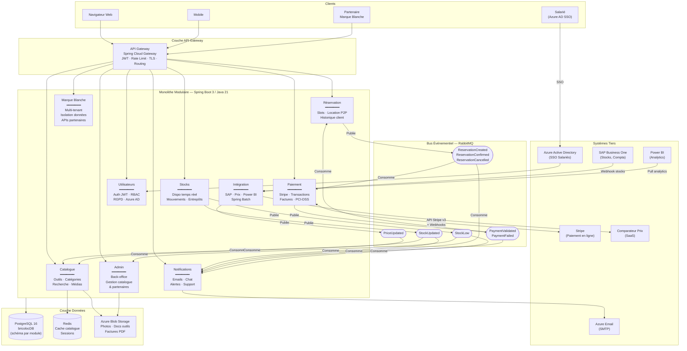

# BricoLoc 2.0 — Architecture logique de l'application

## 1. Introduction

Ce document décrit l'**architecture logique cible** de l'application BricoLoc 2.0. Il détaille les composants logiques, leurs responsabilités, et l'ensemble de leurs interactions.

Cette architecture logique est la traduction concrète des choix faits dans :
- `styles-retenus-justification.md` : Monolithe modulaire + événementiel ciblé + APIs REST
- `matrice-choix-technologique.md` : Spring Boot 3, PostgreSQL 16, RabbitMQ, Azure
- `ENF-exigences-non-fonctionnelles.md` : critères de qualité à respecter

Elle est conçue pour être **développable par les 5 développeurs internes** de BricoLoc dans le cadre d'une **migration progressive** (Strangler Fig) depuis le SI legacy.

---

## 2. Vue d'ensemble — Couches de l'architecture

L'architecture s'organise en **5 couches logiques** :

| Couche | Rôle |
|---|---|
| **Couche Clients** | Navigateurs web, application mobile, partenaires marque blanche |
| **Couche API Gateway** | Point d'entrée unique, authentification, routage, rate limiting |
| **Couche Applicative (Monolithe modulaire)** | Logique métier organisée en modules isolés |
| **Couche Messagerie** | Bus événementiel asynchrone (RabbitMQ) pour les flux découplés |
| **Couche Données** | Persistance (PostgreSQL), cache (Redis), stockage fichiers (Azure Blob) |

Les **systèmes tiers** (SAP, Stripe, comparateur de prix, Power BI) sont accessibles via le module d'intégration, jamais directement depuis les modules métier.

---

## 3. Composants logiques détaillés

### 3.1 — API Gateway

**Technologie** : Spring Cloud Gateway (ou Kong en option)

| Responsabilité | Détail |
|---|---|
| Point d'entrée unique | Toutes les requêtes entrantes passent par ce composant (clients web, mobile, partenaires) |
| Authentification & autorisation | Validation des tokens JWT émis par le module `Utilisateurs` |
| Routage | Redirection vers le module applicatif concerné |
| Rate limiting | Protection contre les abus (ex. scraping du catalogue) |
| HTTPS terminaison | TLS offloading |
| Versioning APIs | Préfixe `/api/v1/`, `/api/v2/` |

**Interactions entrantes** : Clients Web, Mobile, Partenaires marque blanche
**Interactions sortantes** : Tous les modules applicatifs

---

### 3.2 — Module Catalogue

**Responsabilité** : Gestion de l'ensemble des outils disponibles à la location.

| Fonctionnalité | Détail |
|---|---|
| Parcours du catalogue | Par catégorie, avec filtres (prix, disponibilité, type client) |
| Fiche outil | Détail technique, tarifs, conditions, disponibilité (lecture seule publique) |
| Comparateur de prix | Affichage des prix des enseignes concurrentes (données depuis `prixCache`) |
| Recherche | Full-text search sur le catalogue |
| Cache catalogue | Invalidation et alimentation du cache Redis pour les photos et descriptions |
| Gestion des médias | URLs des photos stockées sur Azure Blob Storage |

**Stockage** : Tables `outils`, `categories`, `tarifs`, `medias` dans PostgreSQL
**Cache** : Redis pour les fiches catalogue (TTL configurable)
**Interactions** : Lit depuis PostgreSQL, écrit dans Redis, consomme `PriceUpdated` depuis RabbitMQ

---

### 3.3 — Module Réservation

**Responsabilité** : Gestion du cycle de vie complet d'une location.

| Fonctionnalité | Détail |
|---|---|
| Calendrier de disponibilité | Affichage et consultation (authentification requise) |
| Création de réservation | Vérification disponibilité → création → publication `ReservationCreated` |
| Choix de livraison | Livraison à domicile ou retrait en entrepôt |
| Location entre particuliers | Gestion des offres de particuliers (nouveau B2C) |
| Historique client | Locations passées, en cours, à venir |
| Annulation / modification | Gestion des règles métier d'annulation |

**Stockage** : Tables `reservations`, `slots_disponibilite`, `locations_p2p` dans PostgreSQL
**Événements publiés** : `ReservationCreated`, `ReservationConfirmed`, `ReservationCancelled`
**Événements consommés** : `PaymentValidated` (confirme la réservation), `StockUpdated` (rafraîchit la dispo)

---

### 3.4 — Module Stocks

**Responsabilité** : Source de vérité unique sur la disponibilité des outils dans chaque entrepôt.

| Fonctionnalité | Détail |
|---|---|
| État des stocks par entrepôt | Disponible, loué, en maintenance, retiré |
| Mise à jour temps réel | Via consommation d'événements RabbitMQ depuis SAP |
| Cohérence inter-entrepôts | Transferts d'outils entre entrepôts |
| API stocks pour les entrepôts | Remplacement du client lourd C# / WCF VB.NET |
| Gestion des gros outils | Marquage « retrait obligatoire en entrepôt » |

**Stockage** : Tables `stocks`, `mouvements_stock`, `entrepots` dans PostgreSQL
**Événements consommés** : `StockUpdated` (depuis SAP via module Intégration)
**Événements publiés** : `StockLow` (alerte seuil bas), `StockUpdated` (downstream vers Catalogue)
**Remplace** : Batch CSV quotidien + Client lourd C# + Service WCF VB.NET

---

### 3.5 — Module Paiement

**Responsabilité** : Gestion de toutes les transactions financières.

| Fonctionnalité | Détail |
|---|---|
| Paiement en ligne | Intégration Stripe API v3 (création Payment Intent) |
| Paiement en entrepôt | Enregistrement du paiement physique par le logisticien |
| Historique transactions | Consultable par le client et l'admin |
| Remboursements | Via API Stripe Refund |
| Conformité PCI-DSS | Aucune donnée carte stockée côté BricoLoc (tout chez Stripe) |

**Stockage** : Tables `transactions`, `factures` dans PostgreSQL (jamais de données carte)
**Événements consommés** : `ReservationConfirmed` (déclenche le flux de paiement)
**Événements publiés** : `PaymentValidated`, `PaymentFailed`
**Interactions externes** : Stripe API (sortant), Stripe Webhook (entrant via API Gateway)

---

### 3.6 — Module Utilisateurs

**Responsabilité** : Gestion des identités, authentification et autorisations.

| Fonctionnalité | Détail |
|---|---|
| Inscription client | B2C (particulier), B2B (professionnel indépendant), futur B2B grands comptes |
| Authentification | Login / logout, émission de tokens JWT |
| Gestion des profils | Adresse, préférences, type de compte |
| RBAC | Rôles : `CLIENT`, `PROFESSIONNEL`, `LOGISTICIEN`, `ADMIN`, `PARTENAIRE` |
| Gestion des accès admin | Fin des comptes créés directement en BDD (adresse AN-04) |
| Intégration Active Directory | Authentification des salariés via Azure AD (SSO) |
| RGPD | Droit à l'oubli, export des données personnelles |

**Stockage** : Tables `utilisateurs`, `roles`, `sessions` dans PostgreSQL (remplace `autorisationDB` Oracle)
**Interactions** : Fournit les tokens JWT validés par l'API Gateway

---

### 3.7 — Module Notifications

**Responsabilité** : Orchestration de toutes les communications sortantes vers les clients et logisticiens.

| Fonctionnalité | Détail |
|---|---|
| E-mails transactionnels | Confirmation de réservation, rappel de retour, facture |
| Notifications push | (Futur) Application mobile |
| Chat applicatif | Animé par les logisticiens (existant à conserver) |
| Alertes logisticiens | Nouveau retour d'outil, stock bas |
| Support client | Canal de remontée de bug, problème de livraison |

**Événements consommés** : `ReservationConfirmed`, `PaymentValidated`, `StockLow`, `ReservationCancelled`
**Pas de stockage propre** : Logs des notifications envoyées dans PostgreSQL (table `notifications_log`)
**Technologie** : Spring AMQP consumer + JavaMailSender (SMTP Azure)

---

### 3.8 — Module Admin

**Responsabilité** : Interface d'administration opérationnelle pour les équipes internes.

| Fonctionnalité | Détail |
|---|---|
| Gestion du catalogue | Ajout, modification, retrait d'outils |
| Gestion des stocks admin | Saisie manuelle si nécessaire (hors SAP) |
| Gestion des utilisateurs | Activation, suspension, changement de rôle |
| Tableau de bord opérationnel | Réservations en cours, alertes stocks, incidents |
| Gestion des partenaires | Activation/désactivation des tenants marque blanche |

**Accès** : Réservé aux rôles `ADMIN` et `LOGISTICIEN` — authentification via module Utilisateurs
**Remplace** : Interface admin actuelle (accès directs BDD supprimés)

---

### 3.9 — Module Marque Blanche (Multi-tenant)

**Responsabilité** : Isolation et personnalisation de l'application pour les partenaires.

| Fonctionnalité | Détail |
|---|---|
| Isolation des données | Chaque partenaire a un tenant isolé (schéma PostgreSQL dédié ou discriminant `tenant_id`) |
| Personnalisation visuelle | Charte graphique, logo, domaine custom |
| APIs partenaire | REST API documentée pour les partenaires qui veulent leur propre front-end |
| Gestion des droits | Le partenaire ne voit que ses données |
| Facturation | Comptabilisation de l'usage par tenant |

**Remplace** : Déploiement d'infrastructure chez le partenaire (impossible à configurer actuellement)
**Modèle** : SaaS multi-tenant hébergé par BricoLoc — plus de déploiement chez le partenaire

---

### 3.10 — Module Intégration

**Responsabilité** : Passerelle unique entre BricoLoc 2.0 et tous les systèmes tiers.

| Système tiers | Direction | Mécanisme |
|---|---|---|
| SAP Business One | Entrant | Webhook SAP → REST API → publication RabbitMQ `StockUpdated` |
| Comparateur de prix SaaS | Sortant | Job planifié (Spring Scheduler) → APIs REST → publication `PriceUpdated` |
| Power BI | Sortant | Endpoint REST `/api/v1/analytics` consommé par Power BI |
| Transporteurs | Sortant | API REST (futur) pour la gestion des livraisons |

**Remplace** : Service Java passerelle actuel + Batch Java CSV + scripts Python data
**Technologie** : Spring Batch pour les jobs planifiés, Spring Integration pour les flux événementiels

---

## 4. Schéma logique complet

---

## 5. Règles d'architecture à respecter (garde-fous)

Ces règles évitent de reproduire les dérives du SI actuel (logique dans le front, accès directs BDD, PL/SQL métier) :

| Règle | Obligation | Adresse |
|---|---|---|
| **R01** | Aucun module ne peut accéder directement à la table d'un autre module — uniquement via son interface Java publique | AN-01, AN-02 |
| **R02** | Zéro logique métier dans les couches de persistance (pas de triggers, pas de procédures stockées) | AN-02 |
| **R03** | Toute communication avec un système tiers passe par le module `Intégration` | AN-01 |
| **R04** | Toute requête externe passe par l'API Gateway avec un token JWT valide | AN-04 |
| **R05** | Aucune donnée de carte bancaire ne transite ou n'est stockée côté BricoLoc | ENF-04-04 |
| **R06** | Chaque module possède son propre schéma de BDD logique (préfixe de table ou schéma PostgreSQL dédié) | ENF-05-02 |
| **R07** | Chaque événement publié sur RabbitMQ est versionné (`v1.StockUpdated`) | ENF-06 |
| **R08** | Tout code est committé sur Git avant déploiement — aucun déploiement manuel FTP | AN-07, PF-05 |

---

## 6. Composants par développeur — Découpage d'équipe suggéré

| Développeur | Profil | Modules assignés |
|---|---|---|
| Marion H. | Java back-end | `reservation`, `stocks` |
| Piotr S. | Java full-stack | `catalogue`, `admin` |
| Thibaut E. | Java back-end | `utilisateurs`, `marque-blanche` |
| Hervé D. | .NET / Java | `paiement`, module `intégration` (connecteurs SAP) |
| Isabelle A. | Python / Data | Scripts analytics, alimentation Power BI, tests data |

> Ce découpage permet à chaque développeur de posséder un périmètre clair, limite les conflits Git, et distribue équitablement la complexité.
