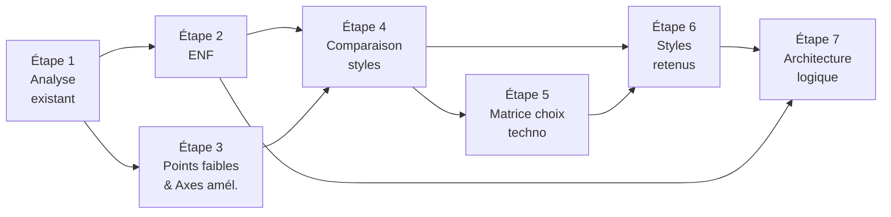

# BricoLoc 2.0 — Démarche de conception de l'architecture logicielle

## 1. Introduction

Ce document décrit la **démarche méthodologique** suivie pour concevoir l'architecture de BricoLoc 2.0. Il explique comment les activités d'architecture logicielle ont été enchaînées, et le lien entre chaque étape et les livrables produits.

La démarche s'appuie sur les activités classiques d'architecture logicielle : comprendre l'existant, identifier les contraintes, choisir les styles et technologies, puis schématiser l'architecture cible.

---

## 2. Étapes de la démarche

```
Étape 1 → Analyse de l'existant
Étape 2 → Identification des exigences non fonctionnelles
Étape 3 → Identification des points faibles et axes d'amélioration
Étape 4 → Comparaison des styles architecturaux
Étape 5 → Choix des technologies (matrice de décision)
Étape 6 → Sélection des styles retenus et justification
Étape 7 → Conception de l'architecture logique cible
```

Chaque étape alimente la suivante. Aucun choix d'architecture n'est fait avant d'avoir établi les contraintes qui l'encadrent.

---

## 3. Détail de chaque étape

### Étape 1 — Analyse de l'existant

**Livrable** : `schema-SI-existant.md`

**Activités** :
- Inventaire de tous les composants applicatifs, serveurs et bases de données du SI BricoLoc.
- Modélisation des interactions entre composants (flux de données, protocoles, sens).
- Identification des anomalies architecturales (accès directs BDD, code perdu, VM fantôme, batch fragile).
- Évaluation de l'état de chaque composant (EOL, legacy, critique, actif).

**Principe directeur** : on ne peut concevoir une nouvelle architecture sans comprendre précisément l'existant à remplacer. La dette technique identifiée ici conditionne le choix du pattern de migration (Strangler Fig).

---

### Étape 2 — Identification des exigences non fonctionnelles (ENF)

**Livrable** : `ENF-exigences-non-fonctionnelles.md`

**Activités** :
- Croisement des symptômes opérationnels (perte de clients, régressions, incohérences stocks) avec les besoins qualité exprimés.
- Structuration en 8 domaines : Performance, Disponibilité, Scalabilité, Sécurité, Maintenabilité, Interopérabilité, Portabilité, Observabilité.
- Qualification de chaque ENF avec une métrique cible (ex. SLA ≥ 99,5%, temps de réponse < 2s au P95).

**Principe directeur** : les ENF sont les critères d'acceptation de l'architecture. Tout style ou technologie qui ne permet pas d'atteindre ces métriques est écarté, indépendamment de sa popularité.

---

### Étape 3 — Identification des points faibles et axes d'amélioration

**Livrable** : `axes-amelioration-points-faibles.md`

**Activités** :
- Classification des dysfonctionnements du SI selon leur criticité (🔴 Critique, 🟠 Élevé, 🟡 Modéré).
- Mise en lien des points faibles avec leurs impacts métier (chiffrage qualitatif, liens directs avec la perte de clients).
- Formulation de 6 axes d'amélioration orientés décideurs (pas uniquement techniques).

**Principe directeur** : l'architecture logicielle ne sert pas uniquement à répondre à des problèmes techniques — elle doit résoudre des problèmes métier. Les axes d'amélioration traduisent les points faibles techniques en décisions stratégiques compréhensibles par la direction.

---

### Étape 4 — Comparaison des styles architecturaux

**Livrable** : `comparaison-styles-architecturaux.md`

**Activités** :
- Sélection de 5 styles candidats représentatifs du marché : N-tiers, Monolithe modulaire, SOA, Microservices, Événementiel.
- Présentation neutre de chaque style (avantages et inconvénients généraux).
- Scoring multicritère sur 11 dimensions pondérées par les ENF et les contraintes BricoLoc.
- Analyse des styles au regard des 4 contraintes critiques du projet (équipe 5 devs, migration progressive, stocks temps réel, marque blanche).

**Principe directeur** : aucun style n'est universel. La comparaison s'effectue toujours en contexte — un style excellent en théorie peut être inadapté à une équipe ou un budget donnés.

---

### Étape 5 — Choix des technologies (matrice de décision)

**Livrable** : `matrice-choix-technologique.md`

**Activités** :
- Définition d'une grille de 8 critères pondérés ancrés dans le contexte BricoLoc.
- Application de la grille sur 4 décisions technologiques structurantes : framework back-end, SGBDR, bus de messages, cloud.
- Calcul d'un score pondéré et justification de la décision retenue par rapport aux alternatives.

**Principe directeur** : une décision technologique non justifiée est réversible seulement au prix d'un coût élevé. La matrice de choix trace la décision de manière auditée, reproductible, et communicable aux décideurs non techniques.

---

### Étape 6 — Styles retenus et justification

**Livrable** : `styles-retenus-justification.md`

**Activités** :
- Synthèse des styles retenus à partir de l'étape 4 et de l'étape 5 : architecture hybride (monolithe modulaire + événementiel ciblé + APIs REST légères).
- Justification de chaque style retenu au regard des ENF et des points faibles identifiés.
- Justification explicite des styles écartés (microservices, SOA avec ESB, serverless).
- Définition de la stratégie de migration (Strangler Fig) avec phasage en 6 phases.

**Principe directeur** : la justification des choix est aussi importante que les choix eux-mêmes. Elle permet à l'équipe de savoir pourquoi une décision a été prise et de la remettre en question si le contexte change.

---

### Étape 7 — Architecture logique cible

**Livrable** : `architecture-logique.md`

**Activités** :
- Décomposition de l'application en 10 modules logiques avec leurs responsabilités précises.
- Définition des interactions synchrones (appels via API Gateway) et asynchrones (événements RabbitMQ).
- Identification des données associées à chaque module (tables PostgreSQL, cache Redis, fichiers Azure Blob).
- Définition des 8 règles d'architecture à respecter pour éviter les mêmes dérives que le SI actuel.
- Suggestion d'affectation des modules aux développeurs internes.

**Principe directeur** : l'architecture logique est le contrat de construction. Elle doit être suffisamment détaillée pour qu'un développeur puisse démarrer sans ambiguïté, et suffisamment lisible pour qu'un décideur comprenne ce qui est construit.

---

## 4. Cohérence de la démarche — Vue d'ensemble



**Lecture** : l'analyse de l'existant et les ENF alimentent la comparaison des styles. Les styles retenus, éclairés par la matrice technologique, structurent l'architecture logique finale. Les ENF traversent toute la démarche comme fil directeur permanent.

---

## 5. Traçabilité ENF → Architecture

| ENF | Style / composant qui l'adresse | Livrable |
|---|---|---|
| ENF-01 Performance | Monolithe + Redis cache catalogue | architecture-logique §3.2 |
| ENF-02 Disponibilité | Événementiel (isolation pannes) + modules isolés | styles-retenus §2.2 |
| ENF-03 Scalabilité | Scale-out monolithe sur Azure + événementiel SAP | styles-retenus §2.2 |
| ENF-04 Sécurité | API Gateway JWT + module Utilisateurs (IAM) + R04 | architecture-logique §3.1, §3.6 |
| ENF-05 Maintenabilité | Monolithe modulaire + R01 à R08 | architecture-logique §5 |
| ENF-06 Interopérabilité | Module Intégration + APIs REST versionnées | architecture-logique §3.10 |
| ENF-07 Portabilité | Spring Boot + Docker + Azure | matrice-choix §5.1, §5.4 |
| ENF-08 Observabilité | Spring Actuator + logs centralisés Azure | architecture-logique §3.1 |
