# BricoLoc — Schéma du SI Existant (Version complétée)

## 1. Périmètre

Ce schéma représente l'ensemble des **applications, services et composants** du SI de BricoLoc ainsi que leurs **interactions**. Il complète et enrichit le schéma succinct fourni par le responsable informatique, en intégrant les informations détaillées extraites de l'analyse de l'existant.

Les annotations signalent les **anomalies architecturales**, **risques** et **dettes techniques** majeurs identifiés.

---

## 2. Schéma complet du SI existant

```mermaid
flowchart TB

    %% ══════════════════════════════════════════
    %% ACTEURS EXTERNES
    %% ══════════════════════════════════════════
    ClientWeb(["👤 Client Web / Mobile\n(B2C, Professionnel indépendant)"])
    Partenaire(["🏪 Partenaire\nmarque blanche\n(Hypermarché)"])
    Transporteur(["🚚 Transporteur\n(relation via Pauline M.)"])
    Stripe(["💳 Stripe\nPaiement en ligne\n(SaaS)"])
    ComparateurSaaS(["📊 Comparateur de prix\n(SaaS externe)\nAPIs REST"])
    Fournisseur(["📦 Fournisseur\n(achat outils via Paul M.)"])

    %% ══════════════════════════════════════════
    %% FRONT-END APPLICATION BRICOLOC
    %% ══════════════════════════════════════════
    subgraph FrontEnd["🖥 Front-End — Ubuntu 20.04 LTS"]
        Apache["Apache HTTP Server\n(Reverse Proxy)"]
        Tomcat["Tomcat 8.5 + Spring 5\nFront-End BricoLoc"]
        MySQLCache[("MySQL 5\nCache photos, docs,\ntextes dynamiques")]
        MetierFront["⚠️ Logique métier\ndéplacée dans le front\nau fil des années"]:::danger
    end

    %% ══════════════════════════════════════════
    %% BACK-END APPLICATION BRICOLOC
    %% ══════════════════════════════════════════
    subgraph BackEnd["⚙️ Back-End — Oracle Linux 6.5"]
        WebLogic["WebLogic 12c R1\nJava EE 6 (EJB / JPA)\nLogique métier principale"]:::legacy
    end

    %% ══════════════════════════════════════════
    %% BASE DE DONNÉES
    %% ══════════════════════════════════════════
    subgraph OracleCluster["🗄 Cluster Oracle 11g R2 — 2 nœuds physiques (surcoût licences)"]
        BricolocDB[("bricolocDB\nBase principale\n⚠️ Tables > 150 col.\nPL/SQL métier")]:::legacy
        AutorisationDB[("autorisationDB\nComptes utilisateurs\n& rôles applicatifs")]
        PrixDB[("prixDB\nDonnées concurrents\n(comparateur)")]
    end

    PLSQL["🔴 Procédures & Triggers\nPL/SQL — Logique métier\n(seul Didier L. maîtrise)"]:::sfo

    %% ══════════════════════════════════════════
    %% INFRASTRUCTURE WINDOWS SIEGE
    %% ══════════════════════════════════════════
    subgraph WindowsSiege["🏢 Infrastructure Windows — Siège Toulouse"]
        AD["Active Directory\n2 DC redondés\n1 domaine Windows"]
        Exchange["Exchange 2019\nWindows Server 2022"]
        FichiersWin["Serveur de fichiers\nWindows Server 2022\nDocs, CSV stocks"]
        FichiersLinux["🔴 Serveur Ubuntu FTP\nSources code\nSans Git — Pas de versioning"]:::danger
        SAP["ERP SAP Business One 9.X\nWindows Server 2022\nGestion : compta, achats, stocks (test)"]:::erp
        PowerBI["Power BI\nTableaux de bord"]
        WCF["🔴 IIS 8 + Service WCF VB.NET\nWindows Server 2012\n⚠️ CODE SOURCE PERDU"]:::critical
        VMFantome["👻 VM VirtualBox Red Hat Linux\nServeur physique\n⚠️ Rôle inconnu — Accès perdus\nmais active et pingable"]:::ghost
    end

    %% ══════════════════════════════════════════
    %% SERVICES D'INTEGRATION
    %% ══════════════════════════════════════════
    ServiceJavaPrix["Service Java\nPasserelle comparateur de prix\n+ transfert stocks SAP→bricolocDB"]
    BatchJava["🔴 Batch Java asynchrone\nLecture CSV quotidien\n→ invocation PL/SQL\n(fragile & non temps réel)"]:::danger

    %% ══════════════════════════════════════════
    %% ENTREPOTS
    %% ══════════════════════════════════════════
    subgraph Entrepots["🏭 10 Entrepôts (Toulouse siège + 9 régionaux)"]
        EntrepotLegacy["6 entrepôts\n(Client lourd C#\nvia WCF VB.NET)"]:::legacy
        EntrepotSAP["4 entrepôts en test\n(Saisie directe SAP B1)\nToulouse, Bordeaux, Montpellier, Avignon"]:::erp
    end

    InterfaceAdmin["Interface Admin BricoLoc\n(Réservée aux développeurs)"]

    %% ══════════════════════════════════════════
    %% SALARIES
    %% ══════════════════════════════════════════
    Salarie(["👥 Salariés\n(bureautique, mail, SAP)"])
    Logisticien(["👷 Logisticiens\n(stock + animation chat)"])


    %% ══════════════════════════════════════════
    %% FLUX — UTILISATEURS & APPLICATION
    %% ══════════════════════════════════════════
    ClientWeb -->|"HTTPS"| Apache
    Partenaire -->|"HTTPS\n(config difficile)"| Apache
    Apache -->|"HTTP interne"| Tomcat
    Tomcat <-->|"SOAP"| WebLogic
    Tomcat --> MySQLCache
    MetierFront -. "⚠️ Accès direct JDBC\nsans passer par le back-end" .-> BricolocDB
    Tomcat --> Stripe
    ClientWeb --> Stripe

    %% ══════════════════════════════════════════
    %% FLUX — BACK-END & BDD
    %% ══════════════════════════════════════════
    WebLogic --> BricolocDB
    WebLogic --> AutorisationDB
    BricolocDB <--> PLSQL
    PLSQL --> BricolocDB

    InterfaceAdmin -->|"Accès web"| Tomcat
    InterfaceAdmin -. "⚠️ Comptes admin\ncréés directement en base" .-> BricolocDB

    %% ══════════════════════════════════════════
    %% FLUX — ENTREPOTS & STOCKS
    %% ══════════════════════════════════════════
    EntrepotLegacy -->|"Client lourd C# → WCF"| WCF
    WCF -->|"Accès direct\nà bricolocDB"| BricolocDB
    EntrepotSAP -->|"Saisie stocks"| SAP
    Logisticien --> EntrepotLegacy & EntrepotSAP

    %% ══════════════════════════════════════════
    %% FLUX — SAP & SYNCHRONISATION STOCKS
    %% ══════════════════════════════════════════
    SAP -->|"Export CSV\nstocks quotidien"| FichiersWin
    FichiersWin -->|"Lecture CSV"| BatchJava
    BatchJava -->|"Invocation\nProcédure stockée PL/SQL"| BricolocDB

    %% ══════════════════════════════════════════
    %% FLUX — COMPARATEUR PRIX
    %% ══════════════════════════════════════════
    ComparateurSaaS -->|"APIs REST"| ServiceJavaPrix
    ServiceJavaPrix --> PrixDB
    ServiceJavaPrix --> SAP
    ServiceJavaPrix --> PowerBI
    ServiceJavaPrix -->|"Batch"| BatchJava

    %% ══════════════════════════════════════════
    %% FLUX — POWER BI & DATA
    %% ══════════════════════════════════════════
    PowerBI --> SAP & BricolocDB & PrixDB
    PythonData["Scripts Python\n(Isabelle A.)"] --> PowerBI
    PythonData --> BricolocDB

    %% ══════════════════════════════════════════
    %% FLUX — SALARIES & BUREAUTIQUE
    %% ══════════════════════════════════════════
    Salarie --> SAP & Exchange & FichiersWin
    Salarie -->|"Office 365"| O365["Office 365\n(SaaS Microsoft)"]

    %% ══════════════════════════════════════════
    %% FLUX — RÉSEAU ENTREPOTS
    %% ══════════════════════════════════════════
    VPN["VPN — FAI\nCommunication Siège ↔ Entrepôts"]
    Entrepots <-->|"VPN"| VPN
    VPN <-->|"VPN"| WindowsSiege

    %% ══════════════════════════════════════════
    %% STYLES
    %% ══════════════════════════════════════════
    classDef legacy fill:#fff3e0,stroke:#ef6c00,stroke-width:2px,color:#e65100
    classDef danger fill:#ffebee,stroke:#c62828,stroke-width:3px,color:#b71c1c,font-weight:bold
    classDef critical fill:#b71c1c,stroke:#7f0000,stroke-width:4px,color:#ffffff,font-weight:bold
    classDef sfo fill:#ede7f6,stroke:#6a1b9a,stroke-width:3px,color:#4a148c
    classDef ghost fill:#f3e5f5,stroke:#7b1fa2,stroke-dasharray:8 4
    classDef erp fill:#e3f2fd,stroke:#1565c0,stroke-width:2px
```

---

## 3. Légende des annotations

| Symbole / Style | Signification |
|---|---|
| 🔴 Rouge vif / bordure épaisse | Anomalie critique ou composant en péril |
| 🟠 Orange | Composant legacy / obsolète |
| 🟣 Violet | Logique métier PL/SQL (couche non standard) |
| 👻 Pointillés violets | Composant fantôme (rôle inconnu) |
| 🔵 Bleu | ERP SAP (périmètre fonctionnel dédié) |
| ⚠️ Flèches pointillées | Violation architecturale (accès non autorisé) |

---

## 4. Inventaire des composants

### Applications et services

| Composant | Technologie | Hébergement | État |
|---|---|---|---|
| Front-end BricoLoc | Spring 5 / Tomcat 8.5 | Ubuntu 20.04 LTS | ⚠️ Obsolète |
| Back-end BricoLoc | Java EE 6 / WebLogic 12c R1 | Oracle Linux 6.5 | 🔴 Critique |
| Service WCF entrepôts | VB.NET / IIS 8 | Windows Server 2012 | 🔴 Code perdu |
| Service Java passerelle prix | Java | Siège | ⚠️ À refactoriser |
| Batch Java stocks | Java | Siège | 🔴 Fragile |
| ERP SAP Business One 9.X | SAP B1 | Windows Server 2022 | ✅ En service |
| Power BI | Microsoft Power BI | Windows | ✅ En service |
| Scripts Python Data | Python | Siège | ✅ En service |
| Client lourd stocks | C# (.NET) | 6 entrepôts | ⚠️ Legacy |
| Office 365 | Microsoft SaaS | Cloud Microsoft | ✅ En service |
| Stripe | SaaS | Cloud Stripe | ✅ En service |
| Comparateur prix | SaaS externe | Cloud tiers | ✅ En service |

### Bases de données

| Base | Moteur | État | Risque |
|---|---|---|---|
| bricolocDB | Oracle 11g R2 | 🔴 EOL | Tables > 150 colonnes, logique PL/SQL |
| autorisationDB | Oracle 11g R2 | 🔴 EOL | Comptes admin créés directement |
| prixDB | Oracle 11g R2 | 🔴 EOL | Dépendance service Java |
| MySQL cache | MySQL Community 5 | ⚠️ Obsolète | Colocalisé front-end |

### Infrastructure

| Serveur | OS | Rôle | État |
|---|---|---|---|
| Ubuntu 20.04 LTS | Linux | Front-end BricoLoc | ⚠️ |
| Oracle Linux 6.5 (x2) | Linux | Back-end + Oracle cluster | 🔴 EOL |
| Windows Server 2022 | Windows | AD, SAP, Exchange, Fichiers | ✅ |
| Windows Server 2012 | Windows | IIS 8 + WCF | 🔴 EOL + code perdu |
| Ubuntu 20.04 FTP | Linux | Sources code | 🔴 Sans versioning |
| Serveur VM VirtualBox | Linux | VM Red Hat fantôme | 👻 Inconnu |

---

## 5. Anomalies architecturales majeures

| ID | Anomalie | Composant concerné | Impact |
|---|---|---|---|
| AN-01 | Accès direct JDBC front-end → bricolocDB | Spring Front / bricolocDB | Court-circuit du back-end, sécurité |
| AN-02 | Logique métier dans les triggers PL/SQL | bricolocDB | Régressions, maintenabilité |
| AN-03 | Logique métier dans le front-end Spring | Tomcat / Spring 5 | Régressions, couplage |
| AN-04 | Comptes admin créés directement en base | autorisationDB | Sécurité, traçabilité |
| AN-05 | Code source WCF perdu | IIS 8 / WCF VB.NET | SPOF absolu |
| AN-06 | Synchronisation stocks batch quotidienne CSV | Batch Java / PL/SQL | Incohérence stocks |
| AN-07 | Sources sans contrôle de version | Serveur FTP Ubuntu | Perte code possible |
| AN-08 | VM Red Hat active sans accès ni responsable | VM VirtualBox | Risque réseau, SPOF |
| AN-09 | Windows Server 2012 plus supporté | IIS 8 / WCF | Risque sécurité |
| AN-10 | Oracle Linux 6.5 EOL | Back-end + cluster Oracle | Risque sécurité |
