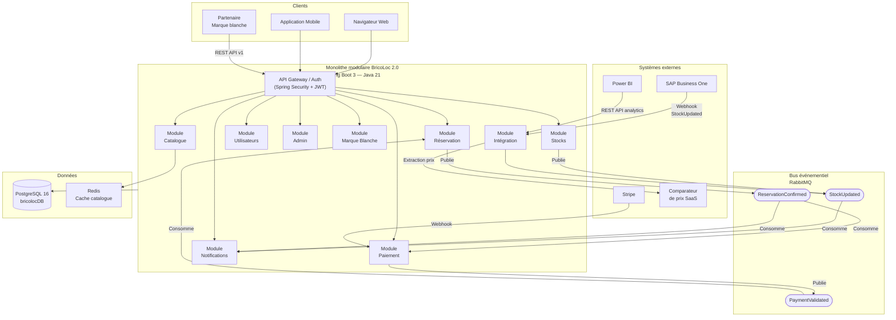

# BricoLoc 2.0 — Styles architecturaux retenus et justification

## 1. Rappel du contexte de décision

Les styles retenus sont issus de la combinaison de trois analyses complémentaires :

- **Analyse de l'existant** : monolithe N-tiers de 2013, stack obsolète, logique métier éparpillée, batch de stocks fragile, service WCF sans source, FTP sans Git, équipe de 5 développeurs.
- **Exigences non fonctionnelles** (cf. `ENF-exigences-non-fonctionnelles.md`) : performance, disponibilité ≥ 99,5%, scalabilité pour l'expansion européenne, maintenabilité par 5 devs, portabilité cloud.
- **Comparaison des styles** (cf. `comparaison-styles-architecturaux.md`) : le monolithe modulaire score 40/55 et l'événementiel ciblé 40/55, contre 23/55 pour le N-tiers actuel et 39/55 pour les microservices purs — trop complexes pour l'équipe.

La contrainte la plus discriminante est **la faisabilité par une équipe de 5 développeurs** sans expérience DevOps avancée, en mode migration progressive (pas de Big Bang).

---

## 2. Styles retenus

### Style retenu 1 — Monolithe modulaire (core applicatif)

**Définition retenue** : Un seul artéfact déployable (JAR/WAR) structuré en **modules Maven strictement isolés**, avec des interfaces Java définies entre modules. Aucun module ne peut appeler l'implémentation interne d'un autre module — uniquement ses interfaces publiques.

**Modules identifiés pour BricoLoc 2.0** :

| Module | Responsabilité |
|---|---|
| `catalogue` | Gestion du catalogue d'outils, catégories, fiches, photos |
| `reservation` | Gestion des réservations, calendrier de disponibilité |
| `stocks` | Disponibilité des outils par entrepôt |
| `paiement` | Intégration Stripe, historique des transactions |
| `utilisateurs` | Authentification, profils, rôles (B2C, B2B, admin) |
| `notifications` | E-mails, alertes, chat |
| `admin` | Back-office opérateur et logisticiens |
| `marque-blanche` | Isolation multi-tenant pour les partenaires |
| `integration` | Connecteurs SAP, comparateur de prix, Power BI |

**Pourquoi ce style pour BricoLoc** :

- **Faisabilité équipe** : Spring Boot 3 + Maven multi-modules est dans le périmètre exact des 3 développeurs Java (Marion H., Piotr S., Thibaut E.). Aucun apprentissage d'orchestration Kubernetes ou de service mesh.
- **Migration progressive** : Compatible avec le pattern **Strangler Fig** — on peut remplacer module par module le monolithe actuel sans interruption de service.
- **Transactions ACID** : La gestion des réservations et des stocks nécessite des transactions cohérentes entre modules (réserver = décrémenter le stock + créer la réservation + initier le paiement). En monolithe, ces transactions sont gérées nativement par Spring/JPA sans coordination distribuée.
- **Absence de complexité distribuée** : Pas de réseau entre composants, pas de gestion du split-brain, pas de circuit breaker nécessaire entre modules internes.
- **Adresse ENF-05** (maintenabilité) : Un module = une responsabilité = une équipe assignable. Les régressions restent circonscrites à un module si les interfaces sont respectées.

**Ce que ce style ne résout pas seul** :
- La scalabilité indépendante des modules (ex. scaler uniquement `stocks` lors des pics)
- La synchronisation asynchrone avec SAP et les entrepôts

---

### Style retenu 2 — Architecture événementielle ciblée (flux stocks et notifications)

**Définition retenue** : Introduire un **bus de messages** (RabbitMQ, cf. matrice de choix) pour les flux qui nécessitent un découplage asynchrone. L'événementiel n'est **pas appliqué à toute l'architecture** — uniquement aux flux où il apporte une valeur directe.

**Flux concernés** :

| Flux | Événement | Producteur | Consommateur(s) |
|---|---|---|---|
| Retour d'outil à l'entrepôt | `OutilReturned` | Service entrepôt / SAP | Module `stocks`, module `notifications` |
| Mise à jour stock SAP | `StockUpdated` | SAP B1 (via connecteur) | Module `stocks` BricoLoc |
| Réservation confirmée | `ReservationConfirmed` | Module `reservation` | Module `notifications`, module `paiement` |
| Paiement validé | `PaymentValidated` | Module `paiement` (Stripe webhook) | Module `reservation` |
| Nouvelle location entre particuliers | `P2PRentalCreated` | Module `reservation` | Module `notifications`, module `admin` |

**Pourquoi ce style pour BricoLoc** :

- **Adresse ENF-01-03** (stocks temps réel) : Remplace directement le **batch CSV quotidien** qui est la cause principale des incohérences de stocks et de la perte de clients depuis 2020. Un événement `StockUpdated` publié par SAP est consommé immédiatement par le module `stocks`.
- **Adresse ENF-02-05** (isolation des pannes) : Si le module `notifications` est hors ligne, les réservations continuent. Les événements sont persistés dans RabbitMQ et consommés à la reprise.
- **Découplage SAP / BricoLoc** : SAP publie des événements sans appel synchrone vers BricoLoc — les deux systèmes évoluent indépendamment.
- **Compatible avec le monolithe** : Le monolithe publie et consomme des événements via Spring AMQP. Pas besoin de microservices pour bénéficier de l'événementiel.

**Ce que ce style ne remplace pas** :
- Les interactions utilisateur synchrones (consultation catalogue, paiement) qui restent des appels HTTP synchrones dans le monolithe.

---

### Style retenu 3 — APIs REST (intégrations et marque blanche)

**Définition retenue** : Le monolithe expose des **APIs REST documentées** (OpenAPI / Swagger) pour toutes les intégrations externes et pour la marque blanche. C'est une approche SOA **sans ESB** — des contrats d'interface légers, versionnés.

**Interfaces concernées** :

| Interface | Direction | Consommateur |
|---|---|---|
| `GET /api/v1/catalogue` | Sortante | Partenaires marque blanche, mobile |
| `POST /api/v1/reservations` | Sortante | Partenaires marque blanche |
| `POST /api/v1/stocks/webhook` | Entrante | SAP B1 (événements stocks) |
| `GET /api/v1/analytics` | Sortante | Power BI |
| `POST /api/v1/payments/webhook` | Entrante | Stripe |
| `GET /api/v1/prices` | Entrante | Comparateur de prix (via service passerelle) |

**Pourquoi ce style pour BricoLoc** :

- **Adresse ENF-06** (interopérabilité) : SAP Business One 9.X supporte les webhooks et appels REST. Remplace le batch CSV fragile par un appel API propre.
- **Adresse PF-09** (marque blanche) : Les partenaires d'intègrent via API REST documentée — sans déploiement d'infrastructure chez eux. Évolution vers un modèle SaaS multi-tenant.
- **Pas d'ESB** : Contrairement au SOA traditionnel, aucun middleware de transformation centralisé. Chaque intégration est un contrat point-à-point versionné — adapté à une équipe de 5 développeurs.

---

## 3. Ce qui est explicitement écarté

| Style | Raison de l'écart |
|---|---|
| **Microservices purs** | Complexité opérationnelle (Kubernetes, service mesh, distributed tracing) incompatible avec une équipe de 5 devs sans expérience DevOps. Score faisabilité : 1/5. |
| **SOA avec ESB** | ESB = point de centralisation coûteux, gouvernance lourde, disproportionné pour une PME. Score faisabilité : 2/5. |
| **N-tiers actuel reconduit** | Note globale 23/55. Source de tous les problèmes actuels. Reconstruire sur le même modèle dévoyé reproduirait les mêmes dérives. |
| **Serverless pur** | Pas adapté à une application avec état persistant complexe (réservations, stocks) et incompatible avec la marque blanche déployable. |

---

## 4. Stratégie de migration — Pattern Strangler Fig

La migration ne peut pas être un Big Bang. Le **Strangler Fig** consiste à faire coexister l'ancien système et le nouveau, en migrant fonctionnalité par fonctionnalité jusqu'à l'extinction du legacy.

**Phases proposées** :

| Phase | Durée estimée | Actions |
|---|---|---|
| **Phase 0 — Fondations** | 2-3 mois | Mise en place Git, CI/CD, pipeline de déploiement, BDD PostgreSQL parallèle |
| **Phase 1 — Module Stocks** | 3-4 mois | Nouveau module `stocks` + RabbitMQ branché sur SAP. Extinction du batch CSV. |
| **Phase 2 — Module Utilisateurs & Auth** | 2-3 mois | Nouveau service IAM. Suppression des comptes admin en BDD. |
| **Phase 3 — Catalogue & Réservation** | 4-6 mois | Refonte du catalogue et du moteur de réservation. Migration données bricolocDB → PostgreSQL. |
| **Phase 4 — Paiement & Notifications** | 2-3 mois | Intégration Stripe v3, module notifications découplé (événementiel). |
| **Phase 5 — Marque blanche & Internationalisation** | 3-4 mois | Multi-tenant, APIs REST partenaires, internationalisation (i18n). |
| **Phase 6 — Extinction WCF & Legacy** | 1-2 mois | Remplacement du client lourd C# et suppression du WCF VB.NET. |

---

## 5. Diagramme — Architecture hybride retenue

---

## 6. Synthèse de la justification

| Exigence | Style adressant | Comment |
|---|---|---|
| ENF-01 Performance | Monolithe + Redis cache | Pas de saut réseau entre modules ; cache sur catalogue |
| ENF-02 Disponibilité | Événementiel + modules isolés | Panne d'un module ≠ panne globale |
| ENF-03 Scalabilité | Monolithe (scalabilité horizontale du tout) + événementiel | Scale-out du monolithe sur cloud ; SAP découplé |
| ENF-04 Sécurité | API Gateway + module Utilisateurs | IAM centralisé, JWT, suppression accès directs BDD |
| ENF-05 Maintenabilité | Monolithe modulaire | Un module = une responsabilité = une équipe |
| ENF-06 Interopérabilité | APIs REST + événementiel | SAP, Stripe, Power BI via contrats d'interface versionnés |
| ENF-07 Portabilité | Spring Boot + Docker + Azure | Déployable en conteneur sur n'importe quel cloud |
| ENF-08 Observabilité | Spring Actuator + logs centralisés | Métriques exposées nativement par Spring Boot |
