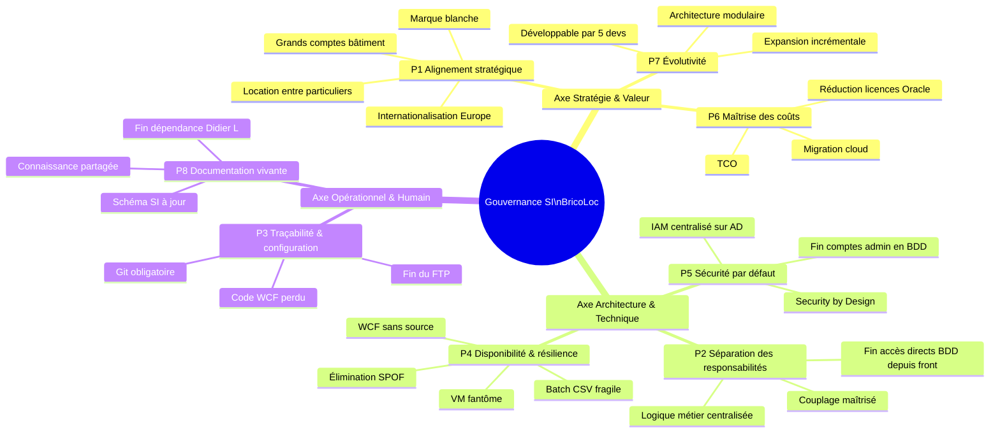

# Gouvernance du SI BricoLoc — Principes de gouvernance

## 1. Pourquoi des principes de gouvernance ?

Les principes de gouvernance constituent le **cadre de référence** qui guide toutes les décisions d'architecture, de développement et d'exploitation du SI. Ils ne sont pas des règles abstraites : chacun est ancré dans les dysfonctionnements concrets et les ambitions stratégiques identifiés lors de l'analyse de l'existant de BricoLoc.

Sans ce cadre, BricoLoc continuera à subir les mêmes dérives qui ont conduit à la situation actuelle : logique métier éparpillée, dette technique incontrôlée, perte de code source, incohérence des stocks, érosion de la base client.

---

## 2. Principes de gouvernance

### P1 — Alignement stratégique
> *Toute décision concernant le SI doit être évaluée au regard de la stratégie de l'entreprise.*

**Justification BricoLoc** : La direction a défini des axes clairs — internationalisation vers l'Europe (Bruxelles, Lausanne, Francfort, puis Italie et Espagne), ouverture à la location entre particuliers (B2C), montée en gamme vers les grands comptes du bâtiment (B2B), et maintien de la capacité marque blanche. Aucune décision technologique ne peut être prise sans évaluer sa cohérence avec ces axes à 3 et 5 ans.

---

### P2 — Séparation des responsabilités (Separation of Concerns)
> *Chaque composant du SI a un périmètre de responsabilité clair et unique. Les couplages non maîtrisés sont prohibés.*

**Justification BricoLoc** : L'analyse révèle une violation systématique de ce principe — logique métier implémentée simultanément dans le front-end Spring, dans les EJB du back-end WebLogic, et dans les procédures/triggers PL/SQL Oracle. Des composants front-end accèdent directement à `bricolocDB` sans passer par le back-end. Cette situation est la cause principale des régressions en cascade lors de la maintenance corrective.

---

### P3 — Traçabilité et gestion de configuration
> *Tout artefact du SI (code source, configuration, script, documentation) doit être versionné, tracé et associé à un responsable.*

**Justification BricoLoc** : Le code source du service WCF VB.NET — composant critique gérant la communication avec 5 à 6 entrepôts — a été **perdu**. Les sources de l'application sont stockées sur un serveur FTP Ubuntu sans outil de contrôle de version formalisé, chaque développeur gérant ses propres versions « internes ». Ce principe impose l'adoption d'un système de gestion de versions (Git) et d'une politique de gestion des configurations.

---

### P4 — Disponibilité et résilience (pas de SPOF non maîtrisé)
> *Les composants critiques du SI doivent être identifiés et dotés d'une stratégie de continuité. Tout point de défaillance unique (SPOF) doit être documenté et mitigé.*

**Justification BricoLoc** : Plusieurs SPOF critiques ont été identifiés : le service WCF sans code source (impossible à redéployer en cas de panne), le batch Java quotidien CSV→PL/SQL (synchronisation des stocks fragile et lente), et la VM Red Hat active dont personne n'a les accès. La perte de clients depuis 2020 est directement corrélée aux bugs et problèmes de performance liés à ces fragilités.

---

### P5 — Sécurité par défaut (Security by Design)
> *La sécurité n'est pas une couche ajoutée a posteriori — elle est intégrée dès la conception de chaque composant du SI.*

**Justification BricoLoc** : Les comptes administrateurs de l'application BricoLoc sont **créés directement dans la base de données** `bricolocDB`, sans processus de gestion des identités. L'accès direct depuis certains composants front-end à la base de données expose des données sensibles sans contrôle. L'Active Directory existant est sous-exploité pour la gestion centralisée des accès. Ce principe impose un modèle IAM (Identity and Access Management) cohérent, s'appuyant sur l'infrastructure AD existante.

---

### P6 — Maîtrise et optimisation des coûts
> *Les décisions du SI doivent intégrer une analyse coût/bénéfice. Les surcoûts structurels doivent être identifiés et éliminés progressivement.*

**Justification BricoLoc** : Le redéploiement du serveur Oracle sur deux serveurs physiques hautes capacités a engendré des **surcoûts significatifs en licences** (Oracle Database 11g R2 en licence sur serveur physique). SAP Business One 9.X est hébergé en interne alors qu'une migration cloud réduirait les coûts d'infrastructure. Le responsable informatique souhaite explicitement étudier un hébergement cloud — ce principe encadre cette démarche par une logique de TCO (Total Cost of Ownership).

---

### P7 — Évolutivité et ouverture
> *Le SI doit pouvoir évoluer de manière incrémentale, sans remise en cause globale, pour accompagner la croissance de l'entreprise.*

**Justification BricoLoc** : L'application BricoLoc, mise en service en 2013, a « peu évolué » architecturalement depuis lors. Son architecture monolithique et ses dépendances technologiques obsolètes (Java EE 6, WebLogic 12c, Oracle 11g, Tomcat 8.5, Spring 5) rendent chaque évolution coûteuse et risquée. Ce principe impose une architecture cible modulaire, compatible avec une expansion internationale et de nouveaux segments de marché, développable par les 5 développeurs internes.

---

### P8 — Documentation vivante et connaissance partagée
> *La documentation du SI est un actif à maintenir au même titre que le code. Elle doit refléter l'état réel du SI à tout moment.*

**Justification BricoLoc** : Le responsable informatique a lui-même reconnu que le schéma de l'architecture applicative « n'est pas complet » et que sa révision est « toujours remise à plus tard ». La documentation de `bricolocDB` « n'est pas forcément à jour ». Aucun collaborateur ne maîtrise vraiment PL/SQL en dehors de Didier L., créant une **dépendance critique sur une seule personne**. Ce principe impose des revues documentaires régulières et une politique de partage des connaissances.

---

## 3. Synthèse — Axes de gouvernance

Les 8 principes s'organisent autour de **3 axes** complémentaires :

| Axe | Principes |
|---|---|
| **Stratégie & Valeur** | P1 Alignement stratégique · P6 Maîtrise des coûts · P7 Évolutivité |
| **Architecture & Technique** | P2 Séparation des responsabilités · P4 Disponibilité & résilience · P5 Sécurité par défaut |
| **Opérationnel & Humain** | P3 Traçabilité & configuration · P8 Documentation vivante |

---

## 4. Diagramme — Carte des principes de gouvernance

> Les axes **Technique** et **Opérationnel** répondent aux dysfonctionnements immédiats de l'existant. L'axe **Stratégie** encadre la transformation vers BricoLoc 2.0. Les trois axes doivent être adressés en parallèle pour éviter qu'une refonte technique ne reproduise les mêmes problèmes de gouvernance.
